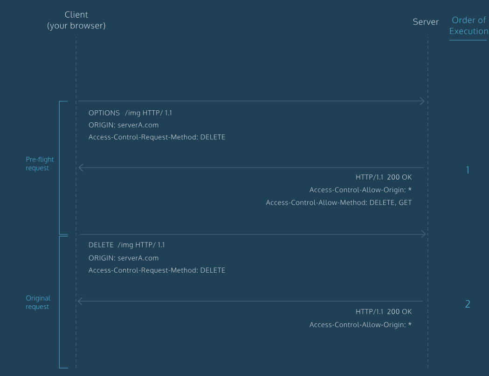

## CORS
This blog will give you a basic knowledge about CORS.   
1.What is same-origin policy?
* The same-origin policy enforces that the documents that interact with each other have the same origin.

2.What is the same origin?
* The same origin means that the urls of the difference resources have the same protocol, the same host and the same port number. 
* Example: 
http://www.example.com/foo-bar.html
http://www.example.com/hello-world.html          
These above two resources have the same origin. The protocal is **HTTP**, the host is **example.com**, the port is **80**(default). 

3.CORS 
* CORS is cross-origin requests
* This allows servers to implement ways to handle requests from origins that is different from theirs. 
* Servers can specify who can access the assets on the server with the help of CORS. 

4.How to implement CORS
* An http header is a piece of information associated with a request or a response
* The CORS stardard manages cross-origin requests by **adding new HTTP headers** to standard list of headers,  for example:   
Access-Control-Allow-Origin: * 
The above header says that this server will share the requested resources with any domain. 

5. When a request is made using any of **the following HTTP request method**, a standard preflight request will be made before origin request. Also, if any of the **headers that are automatically set by your browser are modified**, a preflight request will also be triggered.
* put
* delete
* connect
* options
* trace
* path
Here is image which could illustrate the process

