1. MAC address : First half is the manufacturer's organizationally unique identifier(OUI) . Second half is a unique number
2. arp is used to discover the mac address of another divice . In ethernet mac address is attached to a devices by vendors, I need to know your mac address to talk to your devices in ethernet
3. A media access control address(MAC address) is a unique identifier assigned to a NIC (network interface controller) for use as a network address in communications within a network segment
4. The dynamic host configuration protocal (DHCP) is a network managemnt protocal used on internet protocol networks whereby a DHCP server dynamically assigns an IP address and other network configuration parameters to each device on a network so they can communicate with other IP networks
5. Bridge = learns MAC addresses in software
6. Switch = learns MAC addresses much more quickly by using hardware ASICs(application specific integarted circuits)
7. switches send messages in local network (LAN)
8. switches work on layer 2 (TCP/IP, OSI model)
9. routers allow us to go from our Ethernet LAN, local area network onto the internet(WAN)
10. Protocals and Layers  
  
11. terminology and layers  
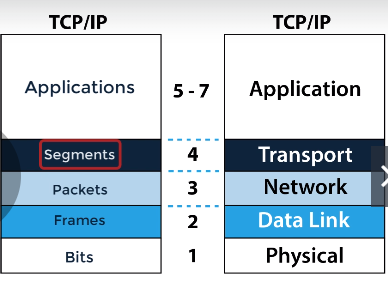  
12. IP address is an layer 3 logical address assigned by an administrator(unlike MAC address that is burnt into NIC by manufacturer, There is no relationship. A MAC Address is a layer-2 address, and an IP address is a layer-3 address. The network layers are independent of each other. The ARP cache is the the link between them. The Address Resolution Protocol is responsible for converting an IP-address to a MAC-address.) 
13. An IP address is used to uniquely identify a device on the network and is used by routers to determine where the device is  
14. The IP address can change within a subnet for example when using DHP or Dynamic Host configuration Protocol   
15. An IP address is used to uniquely identify a device on the network and is used by routers to determine where that device is. So a router routes traffic to a destination IP address based on a hirarchy of network and host    
16. Every device on internet has a unique IP address so there are millions of IP address out there and no two devices can have the same IP address for communication on the internet    
17. IP v4 is connectionless protocal(there are no sessions formed when traffic is transmitted, the transmitter simply sends data without notification to the receiver, no status information is sent back from the receiver to the transmitter)  
18. TCP (transmission control protocol) is connection orientated TCP will setup a session(three way hand shake : syn, ack syn, ack)  
19. IP is not like TCP, it is connectionless protocol and each packet is treated independently of other packets (routers will route the traffic via different paths based on options like load balancing)   
20. Routing protocol determines the best path from A to B (IP)  
21. Hirarchical addressing structure (network and host porion). Routers based the routing decision on the network portion of the address rather than on the host portion of the address   
22. There is no guarantee of packet delivery. Any packet could be misdirected. (depends on the higher layer protocols to gurantee that TCP)   
23. We have the network address portion also known as the network ID, this identifies a specific network. Routers maintain routing tables that contain network addresses. It's important to realize that routers build their routing tables based on the network address and not on the host address. so they do not route packets from 1 interface to another interface based on IP addresses. They do their routing based on network address so they will look at the destination IP address in a packet and match that to a network address in their routing table to determine how traffic is routed. So an IP address  consiste of the network portion as well as the host portion which is also called the host ID, this identifies specific end point on a network such as a server, a printer, a PC and iphone.   
24. Classful networks were used in the internet from 1981 unitil the introduction of classless in domain routing(CIDR) in 1993   
25. Class A,B,C unicast Traffic  
26. Class D - multicast  
27. Class E - reserved for future or experimental purposed   
28. IPV6 does not use address classes  
29. IPV4 address classes was replaced by CIDR  
30. 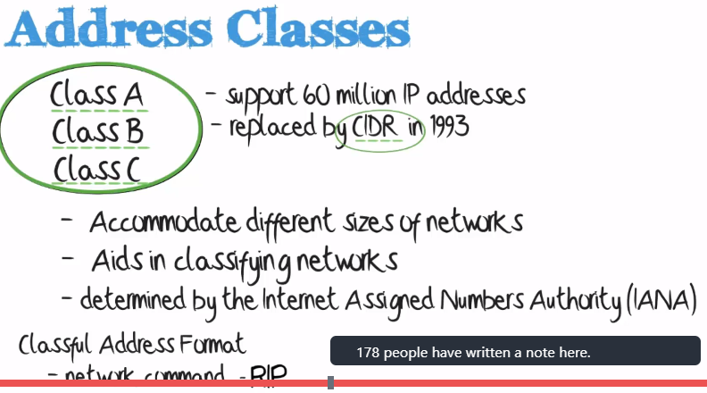  
31. 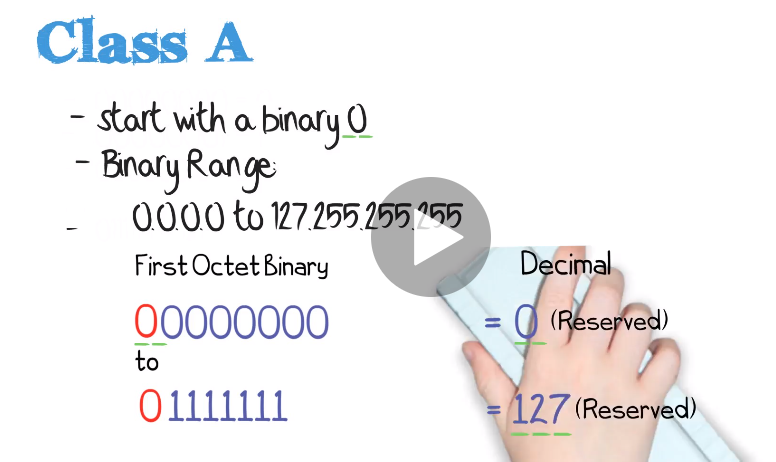  
32. 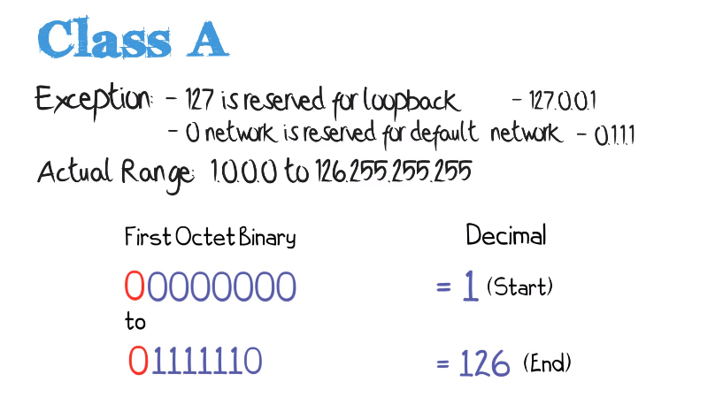   
33. 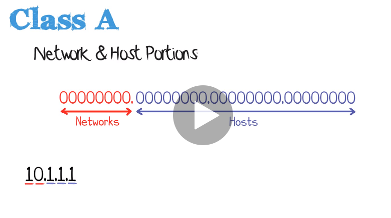  
34. 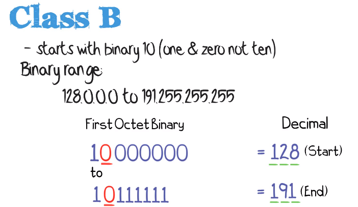  
35. 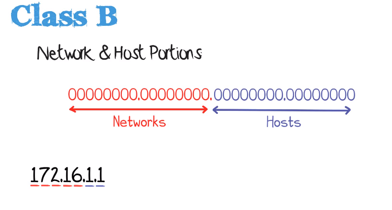  
36. 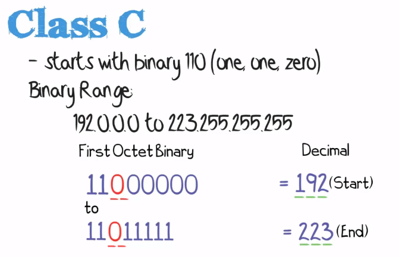   
37. 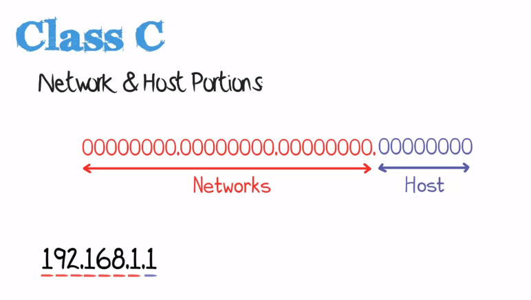  
38. 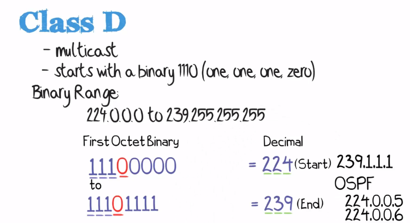     
39. 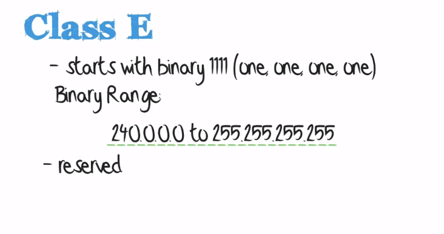   
40. 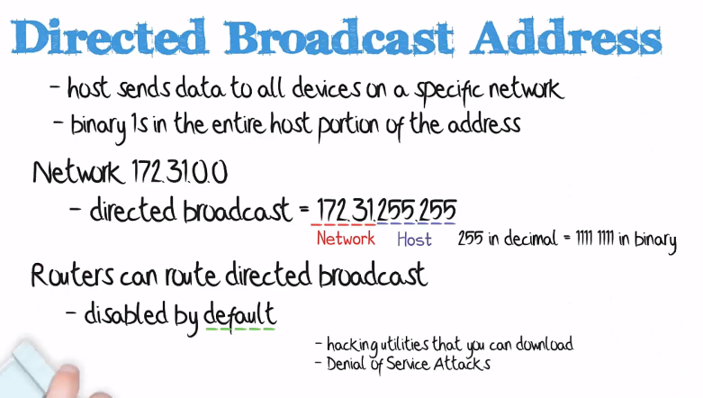   
41. 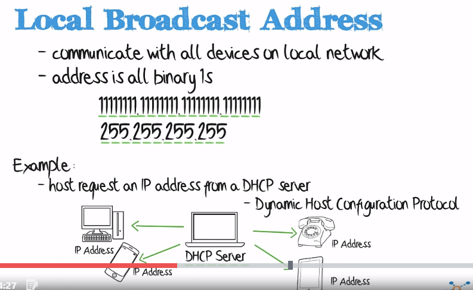  
Examples of Local Broadcast address:   
- Host request an IP address from a DHCP server  
- Dynamic host configuration protocol   
- Providing both wireless connectivity and IP address   
42. By aware that Local Broadcast Address are always dropped by Layer 3 devices such as routers and Layer 3 devices such as routers and Layer 3 switches. You can override that functionality by configuring what is called DHCP forwarding also called DHCP relay on your routers and switches, so as an example if you had a PC or device in VLAN 10 but your DHCP server was on a different VLAN or different network somewhere else in your topology, the DHCP request from the PC or phone would not be received by the DHCP server by default, you would have to configure IP forwarding or IP DHCP relay on the switch or router to forward the DHCP request to the DHCP server    

43. Local Loopback addresss 127.0.0.1 (127.*.*.*).  (Routers have loopback addresses which are not the same as the local loopback address)    
44. Essentially a lot of the information of network protocols comes from RFC (Request For Comments)    RFC1149 ---> how to send data using pigeons   
45. RFC1918 describes the use of the private IP addresses internally within organizations and those IP addresses would be NATed or Address Translated when traffic is sent unto the internet  ( in this RDC it states that the internet assigned numbers Authority or IANA, has reserved the following blocks of IP address space for private internets, so we have network 10 which is a class A address, network 172.16 up to 172.31 which are class B networks and 192.168 all the way up to 192.168.255 which are class C networks)   
46. 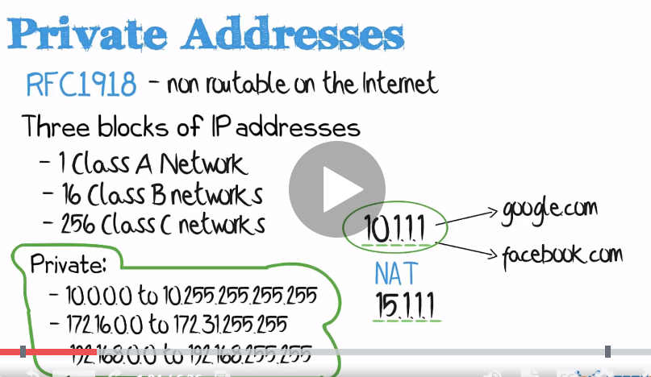   
47. 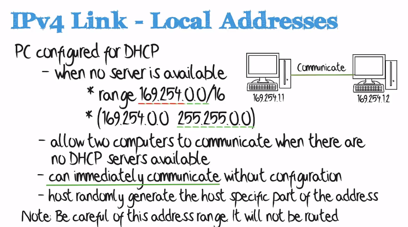   
48. Subnet Mask (Network Address)  
- used to determine network and host portion
- is a device remote or local?   
For example: Address 10.1.1.1 forward message to Address 10.1.2.1 does the computer forward the traffic to the local segment or does it forward it to its default gateway. If they are on different subnets the PCs will forward their traffic to their default gateways which will do the inter-VLAN routing if they are on the local LAN(local are network) or route the traffic if the traffic is forwarded to a traditional router, so a layer 3 switch may do the routing between two VLAN.   
49. VTY   
Line vty 0 4 = 5 simultaneous virtual connections   
Line vty 0 15 = 16 simultaneous virtual connections     
While going through any Cisco Router or Switch configuration, we may come across the term of “line vty 0 4” or “line vty 0 15“.

Let’s discuss these keywords in more detail and their requirement in the configuration of the Cisco Router or Switches     


VTY
The term “vty” stands for Virtual teletype. VTY is a virtual port and used to get Telnet or SSH access to the device.VTY is solely used for inbound connections to the device. These connections are all virtual with no hardware associated with them.

Related Blog – VTY Password

The abstract “0 – 4” means that the device can allow 5 simultaneous virtual connections which may be Telnet or SSH. In a way, we may say that 5 (0 – 4) are connection ports to the Router or Switch. In fact, we may have connection ports up to 16 (0 – 15).

Here is an example where we configure telnet access to a cisco device and password for telnet facility –      

```
R3(config)#line vty 0 4
R3(config-line)#password Cisco
R3(config-line)#login
R3(config-line)#exit
```

