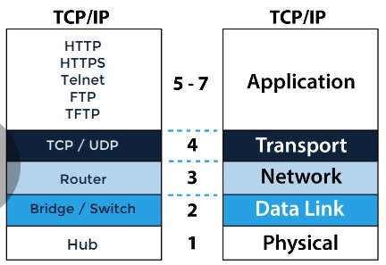

1. MAC address : First half is the manufacturer's organizationally unique identifier(OUI) . Second half is a unique number
2. arp is used to discover the mac address of another divice . In ethernet mac address is attached to a devices by vendors, I need to know your mac address to talk to your devices in ethernet
3. A media access control address(MAC address) is a unique identifier assigned to a NIC (network interface controller) for use as a network address in communications within a network segment
4. The dynamic host configuration protocal (DHCP) is a network managemnt protocal used on internet protocol networks whereby a DHCP server dynamically assigns an IP address and other network configuration parameters to each device on a network so they can communicate with other IP networks
5. Bridge = learns MAC addresses in software
6. Switch = learns MAC addresses much more quickly by using hardware ASICs(application specific integarted circuits)
7. switches send messages in local network (LAN)  switches are very similar to bridges(switches use hardware to get the MAC address table thus much quicker)  
8. switches work on layer 2 (TCP/IP, OSI model)
9. routers allow us to go from our Ethernet LAN, local area network onto the internet(WAN)
10. Protocals and Layers  
  
11. terminology and layers  
  
12. IP address is an layer 3 logical address assigned by an administrator(unlike MAC address that is burnt into NIC by manufacturer, There is no relationship. A MAC Address is a layer-2 address, and an IP address is a layer-3 address. The network layers are independent of each other. The ARP cache is the the link between them. The Address Resolution Protocol is responsible for converting an IP-address to a MAC-address.) 
13. An IP address is used to uniquely identify a device on the network and is used by routers to determine where the device is  
14. The IP address can change within a subnet for example when using DHP or Dynamic Host configuration Protocol   
15. An IP address is used to uniquely identify a device on the network and is used by routers to determine where that device is. So a router routes traffic to a destination IP address based on a hirarchy of network and host    
16. Every device on internet has a unique IP address so there are millions of IP address out there and no two devices can have the same IP address for communication on the internet    
17. IP v4 is connectionless protocal(there are no sessions formed when traffic is transmitted, the transmitter simply sends data without notification to the receiver, no status information is sent back from the receiver to the transmitter)  
18. TCP (transmission control protocol) is connection orientated TCP will setup a session(three way hand shake : syn, ack syn, ack)  
19. IP is not like TCP, it is connectionless protocol and each packet is treated independently of other packets (routers will route the traffic via different paths based on options like load balancing)   
20. Routing protocol determines the best path from A to B (IP)  
21. Hirarchical addressing structure (network and host portion). Routers based the routing decision on the network portion of the address rather than on the host portion of the address   
22. There is no guarantee of packet delivery. Any packet could be misdirected. (depends on the higher layer protocols to gurantee that TCP)   
23. We have the network address portion also known as the network ID, this identifies a specific network. Routers maintain routing tables that contain network addresses. It's important to realize that routers build their routing tables based on the network address and not on the host address. so they do not route packets from 1 interface to another interface based on IP addresses. They do their routing based on network address so they will look at the destination IP address in a packet and match that to a network address in their routing table to determine how traffic is routed. So an IP address  consiste of the network portion as well as the host portion which is also called the host ID, this identifies specific end point on a network such as a server, a printer, a PC and iphone.   
24. Classful networks were used in the internet from 1981 unitil the introduction of classless in domain routing(CIDR) in 1993   
25. Class A,B,C unicast Traffic  
26. Class D - multicast  
27. Class E - reserved for future or experimental purposed   
28. IPV6 does not use address classes  
29. IPV4 address classes was replaced by CIDR  
30.   
31.   
32.    
33.   
34.   
35.   
36.    
37.   
38.      
39.    
40.    
41.   
Examples of Local Broadcast address:   
- Host request an IP address from a DHCP server  
- Dynamic host configuration protocol   
- Providing both wireless connectivity and IP address   
42. By aware that Local Broadcast Address are always dropped by Layer 3 devices such as routers and Layer 3 devices such as routers and Layer 3 switches. You can override that functionality by configuring what is called DHCP forwarding also called DHCP relay on your routers and switches, so as an example if you had a PC or device in VLAN 10 but your DHCP server was on a different VLAN or different network somewhere else in your topology, the DHCP request from the PC or phone would not be received by the DHCP server by default, you would have to configure IP forwarding or IP DHCP relay on the switch or router to forward the DHCP request to the DHCP server    

43. Local Loopback addresss 127.0.0.1 (127.*.*.*).  (Routers have loopback addresses which are not the same as the local loopback address)    
44. Essentially a lot of the information of network protocols comes from RFC (Request For Comments)    RFC1149 ---> how to send data using pigeons   
45. RFC1918 describes the use of the private IP addresses internally within organizations and those IP addresses would be NATed or Address Translated when traffic is sent unto the internet  ( in this RDC it states that the internet assigned numbers Authority or IANA, has reserved the following blocks of IP address space for private internets, so we have network 10 which is a class A address, network 172.16 up to 172.31 which are class B networks and 192.168 all the way up to 192.168.255 which are class C networks)   
46.    
47.    
48. Subnet Mask (Network Address)  
- used to determine network and host portion
- is a device remote or local?   
For example: Address 10.1.1.1 forward message to Address 10.1.2.1 does the computer forward the traffic to the local segment or does it forward it to its default gateway. If they are on different subnets the PCs will forward their traffic to their default gateways which will do the inter-VLAN routing if they are on the local LAN(local are network) or route the traffic if the traffic is forwarded to a traditional router, so a layer 3 switch may do the routing between two VLAN.   
49. VTY   
Line vty 0 4 = 5 simultaneous virtual connections   
Line vty 0 15 = 16 simultaneous virtual connections     
While going through any Cisco Router or Switch configuration, we may come across the term of “line vty 0 4” or “line vty 0 15“.

Let’s discuss these keywords in more detail and their requirement in the configuration of the Cisco Router or Switches     


VTY
The term “vty” stands for Virtual teletype. VTY is a virtual port and used to get Telnet or SSH access to the device.VTY is solely used for inbound connections to the device. These connections are all virtual with no hardware associated with them.

Related Blog – VTY Password

The abstract “0 – 4” means that the device can allow 5 simultaneous virtual connections which may be Telnet or SSH. In a way, we may say that 5 (0 – 4) are connection ports to the Router or Switch. In fact, we may have connection ports up to 16 (0 – 15).

Here is an example where we configure telnet access to a cisco device and password for telnet facility –      

```
R3(config)#line vty 0 4
R3(config-line)#password Cisco
R3(config-line)#login
R3(config-line)#exit
```    

50. telnet && SSH
Telnet is a network protocol that allows a user to communicate with a remote device. It is a virtual terminal protocol used mostly by network administrators to remotely access and manage devices. Administrator can access the device by telnetting to the IP address or hostname of a remote device.

To use telnet, you must have a software (Telnet client) installed. On a remote device, a Telnet server must be installed and running. Telnet uses the TCP port 23 by default.

One of the greatest disadvantages of this protocol is that all data, including usernames and passwords, is sent in clear text, which is a potential security risk. This is the main reason why Telnet is rarely used today and is being replaced by a much secure protocol called SSH. Here you can find information about setting up Telnet access on your Cisco device.


SSH uses the TCP port 22 by default.


Ethernet protocols: physical protocols, describes the medium(wiring), the connections(RJ-45 port), and the signal(voltage lovel on a wire)
TCP/IP protocols: logical protocols, software controlling how and when data is sent and received to computers, supporting physical protocals

Example common TCP/IP suite of Protocols:  
web communication: HTTP  
E-mail: POP3, SMTP, IMAP  
File Transfers: FTP  

### OSI models
what is it？
* The open system interconnection reference model  
* A **conceptual** framework showing us how data moves throughout a network

Why it is developed?
* Created to give us a guide to understand how network operates
* it is only a reference model, so don't get wrapped up in the details
* it is not implemented in the real world, TCP/IP is. 

The OSI Model Stack breaks down the complex task of computer-to-computer network communications into 7 layers
* upper layers (host layers) handled by the host computer and performs application-specific functions, such as data formatting, encryption, and connection management
* Lower Layers (media layers) provide netword-specific functions, such as routing, addressing, and flow control

* upper layers:   
data - application layer,                                       => Application Layer  
data - presentation layer(data representation & encryption)     => Application Layer  
data - Session Layer(Interhost communication),                  => Application Layer  
* lower layers: 
segment - Transport Layer                                             => Transport layer  
Packet  - Network Layer  (Path determination & IP logical addressing  => Internet Layer  
Frame   - Data link layer (MAC and LLC (Pyhsical Addressing)          => network interface layer  
Bit     - Physical Layer (Media, signal and binary transmissions)     => network interface layer  


### TCP/IP Model
The TCP/IP is based on a 4 layer model that is similar to the OSI model
* Application layer : FTP, NFS, SNMP, SMTP, HTTP, POP3
* Transport layer : TCP, UDP
* internet layer: IP, ARP
* Network interface layer: Ethernet, Token Ring


### MAC address
* physical address of the network adapter card(burt into rom chip)
* OSI layer 2 (Data link) layer address
* TCP/IP layer 1( network interface ) layer address

00:21:70:6f:06:f2 first three bytes are assigned by the IEEE to the manufacturer, the last three bytes are usually assigned sequentially

IP addresses
* Network (OSI layer 3) address
* Logical Address
* Allows network-to-network communication via routers(Distant WAN communication)
* Dotted decimal notation 192.168.100.25

MAC Addresses
* Data link (OSI layer 2) addresses
* physical addresses 
* physically burned on NIC
* Allows internetwork communication via hubs, switches, and routes (Local LAN communication)

### Half versus Full duplex communication
* Half duplex can send and receive data, but not at the same time.
* can send and receive data simultaneously

### Ethernet
* refer to a family of standards that together define the physical and data link layers of the worlds's most popular type of LAN
* Is a standard communications protocol for building a local area network(LAN) speeds, cabling, connectors, equipment
* Modern Ethernet uses twisted pair of fiber cable
* Is is a standard model for LANs worldwide. 


1. 当今的因特网， 两种最著名的分组交换机（packet switch）是路由器（router）和链路层交换机（link-layer switch）

2. 端系统通过ISP(Internet Service Provider) 接入因特网。例如本地电缆或电话公司那样的住宅区ISP, 公司ISP, 大学ISP，以及机场，旅馆，咖啡店，和其他公共场所提供的WIFI接入的ISP  

3. 每个ISP是一个， 由多个分子交换机和多段通信链路组成的网络。

4. 各ISP为端系统提供了各种不同类型的网络接入， 例如线缆调制解调器，DSL那样的住宅宽带接入，高速局域网接入，无线接入，56kbps拨号调制解调器接入

5. 底层的ISP通过国家国际的高层ISP连接，高层的ISP由通过高速光纤链路互联的高速路由器组成。无论是高层还是底层ISP网络，它们每个都是独立管理，运行着IP协议

6. 网络边缘 ===>  应用程序和端系统

7. 接入网（access network） ====> 端系统连接到边缘路由器（edge router） 的物理链路

8. 边缘路由器是端系统连接到任何其它远程端系统的路径上的第一个路由器

9. 用户从提供本地电话接入的本地电话公司获得DSL因特网接入（digital subscriber line, DSL）。 所以，本地电话公司就是ISP, 每个用户的DSL调制解调器使用现有的电话线（双绞铜线）    和      位于本地的电话公司本地中心局（CO）中的数字用户线    接入复用器（DSLAM）    来交换数据     =========>      家庭的DSL 调制解调器得到数字数据后将其转换成高频音， 以通过电话线传输给本地中心局，  来自许多家庭的模拟信号在DSLAM处被转换回数字形式

10. 家庭电话线承载了数据和传统的电话信号， （频分复用技术）1. 高速下行信道， 位于50kMz-1MHz  2. 中速上行信道， 位于4kHz 到 50kHz  3. 普通的双向电话信道， 位于0到4kHz频段。 **这种方法把单根DSL线路看起来就像3根单独的线路，因此一个电话呼叫和一个因特网连接能同时共享DSL链路， 在用户一侧，一个分频器把到达家庭的数据信号和电话信号分开，并把数据信号转发给DSL调制解调器。          在本地中心局中， DSLAM把数据和电话信号分开，并把数据送往因特网中**


11. 另一种方式（电缆因特网）vs DSL。利用了有线电视现有的电视基础设施。  

### Online data has to know where it is going
TCP/IP  
Transmission control protocol and internet protocol


#### Application layer
* Browser http/smtp/ssh/ftp
#### Transport layer
* TCP/UDP
#### Internet layer 
* IP

*--- The above three are the ones that we as a developer are most interested in*  
*--- socketio is going to use http and tcp a lot*  
*--- http use tcp as the transport layer*
 <br><br>

#### network layer
* MAC
#### Link (wifi, ethernet) and physical(cables) => network layer

After the application layer gets the data from whatever program you are using, it talks to transport layer through port. Each port can be assigned to a different protocol in the application layer, So TCP knows where the data is coming from . For example most activity in your web browser will go through port 80 which is what HTTP always uses. 

Once TCP gets the data, it chops it up in small chunks called packets so that they can be individually take the quickest route over the internet to get whrerever it is. 
TCP slaps a header to each packet that contains instructions on what order to reasemble the packets as well as error checking information. 

After this, the packets are pushed to internet layer, which uses the internet protocal or IP to attach both the origin and the destination IP address. 

The data is then sent through network layer that handles things like mac addressing so that packets go to the right physical machine


### Example
* You have a computer with internet connection. The transport layer creates 2^16(75000) ports on your computer.

### Socket
* Websocket will allow you to connect to a server's socket via TCP rather than HTTP
* If the server does not allow websocket, socket io will fall over to Long polling, etc
* Every process have tube comeing out of them, out of them can come and go data. 


### Headers
App=> Http, ftp, ssh [(header: metadata, for example, Content-type:text/html) + body]   
Trans => TCP/UDP [(header: source port/Destination port/sequence number/acknowledge number)+http message]
Network => IP [(header: checksum/source ip/destination ip) + tcp message  ]   
Link=> (header:...)  
physical => (header:...)   
