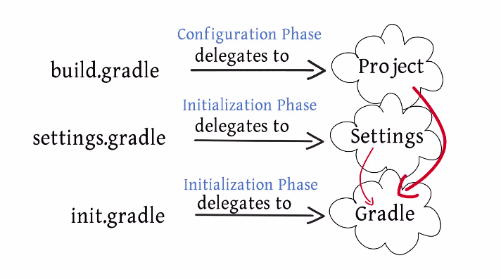

### Gradle  Interface
1. script interface(It is added to every gradle script)
2. project interface(related to build.gradle file)
3. gradle interface 
4. Settings interface (multiproject)
5. Task
6. Action

### This is a sample build.gradle
```
plugins {
    id 'java'
}

group 'com.makemake'
version '1.0-SNAPSHOT'

repositories {
    mavenCentral()
}

dependencies {
    testCompile group: 'junit', name: 'junit', version: '4.12'
    compile 'com.google.code.gson:gson:2.8.0'
}

```

#### Build a project.   
```
./gradlew build    
```


#### show the project object properties
```
./gradlew properties
```


### show the tasks object
```
./gradlew tasks
```


### show all the dependencies
```
 ./gradlew dependencies

```


```
(base) ➜  gradleproject0826 ./gradlew dependencies --configuration compile

> Task :dependencies

------------------------------------------------------------
Root project
------------------------------------------------------------

compile - Dependencies for source set 'main' (deprecated, use 'implementation' instead). (n)
\--- com.google.code.gson:gson:2.8.0 (n)

(n) - Not resolved (configuration is not meant to be resolved)

A web-based, searchable dependency report is available by adding the --scan option.

Deprecated Gradle features were used in this build, making it incompatible with Gradle 7.0.
Use '--warning-mode all' to show the individual deprecation warnings.
See https://docs.gradle.org/6.3/userguide/command_line_interface.html#sec:command_line_warnings

BUILD SUCCESSFUL in 462ms
1 actionable task: 1 executed

```

### list all projects in a project(including subproject--> module)
```
./gradlew projects 
```


### How to clean.    (delete the build folder ).      
```
./gradlew clean
```


### what is a gradle wrapper?   
is a thin layer around gradle.     
check to see that the required version of gradle is installed.     
passes the command into the real gradle.          


### To create the gradle wrapper in case there is none:      
```
gradle wrapper --gradle-version 3.5
```


### What are gradle tasks?    
they are functions performed by gradle
they are consisted of one or more actions

```
gradle build 
```
this will run tasks

```
gradle tasks 
```
list all the tasks.    


### This is an example:   
[https://github.com/RyanGao67/GradlePractice](https://github.com/RyanGao67/GradlePractice)


### Gradle configuration    
In MVN it is scope and in gradle it is configuration

In maven, the scope is compile, provided, runtime, test    
In gradle, the configuration is implementation, api(compile), compileonly(like provided), runtimeonly, testimplementation, testcompileonly, testruntimeonly    

Implementation vs api(previous compile). If current project is a dependency in another project, we can not access the api dependency of current project but we can access the Implementation dependency.   


### Gradle phases
Initialization
Configuration
Execution


To quickly summarize, Gradle goes through three different phases.

For every build you run initialization phases where it will scan through the settings.gradle file.

It will figure out what kind of project our project is, whether it is a single module or, as you will

explore later on, a multi module project.

It will create a project object for each of the projects using the build.gradle contents.

Then it will figure out this acyclic graph that is required and then it will execute all the tasks in

the right order.


### Gradle daemon

Use the daemon: 

```
gradle build --daemon
``` 

// fast because of information is stored in memory

```
gradle build --no-daemon
```

### Gradle tasks

Compile -===> build folder
```
gradle compileJava
```

clean build folder
```
gradle clean
```

```
gradle compileTest
```

Build and create a jar in lib folder
```
gradle jar
```

This is the plugins: 

java plugins to add support for java
application plugins to add support for building a CLI application
```
plugins {
  id 'java'
  id 'application'
}
```

```
application {
  mainClassName = 'com.bfadfaf.app'
}
```
  `gradle run` will run main class because of application plugin


```
gradle --rerun-tasks --build
```
force run all tasks even no code changed


### Gradle project
```
gradle projects

```


### Initialization > configuration > Execution  phase   
Initialization phase map to 1 or more build script eg, settings.gradle

Configuration phase build.gradle (It is the scipt that does the configuration so during the configuration phase the delegate object is the project )   

Execution phase is where the configuration phase get performed by performing a number of tasks


* Initialization    
init.gradle + <xxx>.gradle these scripts run before the actual build (setup enterprise wide settings, to find customized plugins, to setup properties based on the current environment such as a developer's machine vs a continuous integration server, information to authenticate in a db)  the variable here can be accessed afterwords 
    
 
* Settings.gradle 
It is oriented towards multi-project projects
    
    
* configuration phase and execution phase both rely on build.gradle file. If you have a multi project build, each project in your build have to have a build.gradle
Example: 
in .gradle/another.gradle (initialization phase)
```
gradle.ext.timestamp = {
 def df = new SimpleDateFormat("yyyy-MM-dd'T'HH:mm:ss'Z'")
 df.setTimeZone(TimeZone.getTimeZone("UTC"))
 return df.format(new Date())
}
```
    
build.gradle. For example, if you have five object instantiated that implement the script interface that is one for each build script. 



