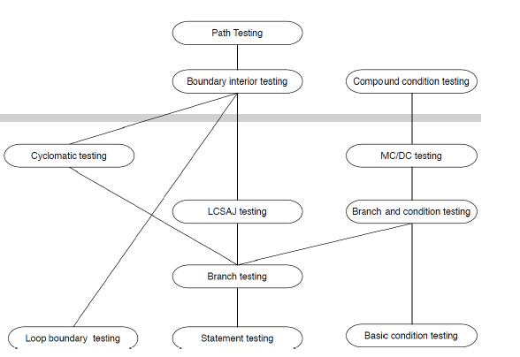

# Finite Abstractions of Behavior
* A single program execution can be viewed as a sequence of states alternating with actions. 
* The possible behaviors of a program are a set of such sequences. 
* The whole set of states and transitions is called the state space of the program
* Models of program execution are abstractions of that space. 
* Two effects of abstraction: (1)The execution model is coarsened (2)mondeterminism is introduced

# Models used frequently
* Control flow graph
* Data flow graph
* State machine
* Decision tables
* Grammars
* Class diagrams
* Call graph

# Why not use UML?
* It is devised promarily for human communication
* Poor in semantic meaning and prediction

# Properties of Models
* Compact
* Predictive **(represent the model so that we can distinguish between good and bad outcomes of analysis)**
* Semantically meaningful **（permit disgnosis of causes of failure）**
* Sufficiently general **(general enough for practical use)**

# (intraprocedual) Control Flow Graph vs (interprocedural, AKA Call graph) Control Flow Graph
* For Call graph, of which there are two kinds: 1. Static 2. Dynamic
* One convention of drawing Call graph is starting from check() function

# Systematic Testing
Functional testing:
* Test cases come from requirements/specs

Structural testing:
* Test cases check the source code

Model-based testing:
* Test cases from models of the system and
its behavior

# Terminology
• Test case: a set of inputs, execution conditions, and a pass/fail criterion.
• Test case specification: a requirement to be satisfied by one or more test cases.
• Test obligation: a partial test case specification requiring some property deemed important to thorough testing
• Test suite: a set of test cases.
• Test or test execution: the activity of executing test cases and evaluating
their results.
• Adequacy criterion: a predicate that is true (satisfied) or false (not
satisfied) of a 〈program, test suite〉 pair.
• Test coverage: percentage of test obligations met for a given adequacy
criterion.

# Where do test obligations come from?
• Functional (black box, specification-based): from software specifications
– Example: If spec requires robust recovery from power failure, test
obligations should include simulated power failure
• Structural (white or glass box): from code
– Example: Traverse each program loop one or more times.
• Model-based: from model of system
– Models used in specification or design, or derived from code
– Example: Exercise all transitions in the UI model
• Fault-based: from hypothesized faults (common bugs)
– Example: Check for buffer overflow handling (common vulnerability) by
testing on very large inputs

# Adequacy criteria
• Adequacy criterion = set of test obligations
• A test suite satisfies an adequacy criterion if
– all the tests succeed (pass)
– every test obligation in the criterion is satisfied by at least one of the test cases in the test suite.
• Example:
the statement coverage adequacy criterion is satisfied by test suite S for program P if each executable statement in P is executed by at least one test case in S, and the outcome of each test execution is “pass”

# Practical in Adequacy Criteria
• Criteria that identify inadequacies in test suites.  
Examples: If no test in the test suite executes a particular program statement, the test suite is inadequate to guard against faults in that particular statement.
• If a test suite fails to satisfy some criterion, the obligation that has not been satisfied may provide some useful
information about improving the test suite.
• If a test suite satisfies all the obligations by all the criteria, we do not know definitively that it is an effective test suite, but we have some evidence of its thoroughness.

# Line Coverage
* Line coverage means the percentage of source code lines executed by test cases.
* Easiest for developer to work with
* Precise percentage depends on layout
* In practice, coverage not based on lines, but on control flow graph

# The control Flow Graph
* Node:
  *  Regions of source code (basic blocks)
  *  Basic block = maximal program region with single entry and single exit point
* Directed edges:
  * possibility that program execution proceeds from the end of one region directly to the beginning of another
* Intra-procedural:
  * within one procedure / method
  * Extra nodes: single entry, single exit for full procedure

# CFG Abstraction Level
* includes Loop condition(Yes)
* includes Individual statements(No)
* includes Exception Handling(No)

# Statement coverage 
* Adequacy criterion: each statement (or node in the CFG) must be executed at least once
* Coverage:
  number of executed statements/ number statements

# Branch Coverage
• Every path going out of node executed at least once
– cover all Decision-, all-edges-
– Coverage: percentage of edges hit.
• Each predicate must be both true and false

# modified condition/decision coverage or MC/DC, also known as the modified condition adequacy criterion. 
The modified condition/decision criterion requires that each D modified condition/
decision coverage (MC/DC) basic condition be shown to independently affect the outcome of each decision. That
is, for each basic condition C, there are two test cases in which the truth values of all evaluated conditions except C are the same, and the compound condition as a whole evaluates to True for one of those test cases and False for the other. The modified condition adequacy criterion can be satisfied with N+1 test cases.

# Path coverage
Adequacy criterion: each path must be executed at least once. 
defined as: number of executed paths/all paths
**How to reduce the number of path tests**
* Loop boundary testing(Limits the number of traversals of loops, zero, once many)
* Boundary interior testing(unfold loop as tree)
* Linear code sequence and jump(limit the length of the paths to be traversed， by using Subpaths of control flow graph
from one branch to another)
* Cyclomatic complexity(Linearly independent paths)

# McCabe's Cyclomatic Complexity
C=|E|-|N|+2  
C=number of decision points + 1  
C>10 means the method is too complex    
We need at most C basis paths, All paths are linear combination of basis cycles.
We need one test case for each basis path. 
**What is basis paths**
* independent paths that span the graph
* Any path that includes at least one edge that is not included in any of the former independent paths
* Start with the longest one

# State Coverage
• Given a state machine of the program
• Have all the states and/or transitions been covered!

# Is 100% coverage Feasible?
No, there are three reasons. (1)Mutually exclusive conditions (2) Dead code (3) This should never happen code
**In practice Statement coverage with 85%-90% is feasible**

# Devise a technique to automatically measure code coverage of your test suite
1. Parse the source code to build an Abstract Syntax Tree(AST)
2. Analyze the AST to build a Control Flow Graph(CFG)
3. Count total number of statements, branches, etc
4. Instrument the AST using the CFG(add tracing statements in code)
5. Transform AST back to instrumented code
6. Recompile and run the test suite on the recompiled code
7. collect tracing data： stm 1 executed stm 3 executed
8. traced points / total number of points 
# Why Coverage may affect test outcomes?What si Heisenberg effect? 
* Heisenberg effect is the act of observing a system inevitably alters its state
* Two reasons: (1)Coverage analysis changes the code by adding tracing statements (2) Instrumentation can change program behaviour

# As we know in-code assertion mess up branch coverage report, what can we do? 
* ALways run your test suite with and without coverage 
* Always run your test suite with and without in-code assertions enabled 

# Subsumption relation

# Why is coverage usful and why is it harmful? 
* Measure coverage can be a useful indicator of progress towards a thorough test suite, of trouble spots requiring more attention
* Coverage is only proxy for thoroughness * It is easy to improve coverage without improving a test suite
**Coverage is not strongly correlated with test suite effectiveness**
**Assertions are Strongly correlated with test suite effectiveness**

# How to use coverage?
* Use coverage to expose code that's not adequately tested(find low values and understand why they are low)
* You can use coverage to estimate the time to modify existing code 
* You can use coverage to evaluate code quality

# Automation is the way to reduce cost
* No way to fully automate testing in predictable future
* Three phase automation:
  * Execution automation
  * Test case generation automation
  * Test oracle check automation

* Software testing consists of two steps:
  * Selecting a set of inputs to a program
  * Determining if the program behaves correctly on each test input

# Benefits of random testing
* Choice of input data at random
* Cheap to inplement 
* Easy to understand
* Pick possible inputs uniformly(characteristic)
* Avoid designed bias(characteristic)
* Treat all inputs as equally important (characteristic)

#What is Feedback-directed random test generation?
* Build test inputs incrementally (new test inputs extend pevious ones)
* As soon as a test is created, executed it
* Use execution results to guide the search

# Input and output of testing
* Input
  * classes under test
  * time limit 
  * set of contracts
    * Method contracts
    * Object invariants
* output 
  * contract-violating test cases

# Random testing VS Systematic testing
* Functional testing is systematic testing 
  * Pick possible inputs uniformly(characteristic)
  * Avoid designed bias(characteristic)
  * Treat all inputs as equally important (characteristic)
* Systematic (non-uniform):
  * Try to select inputs that are especially valuable
  * Usually by choosing representatives of classes that are supposed to fail often or not at all
  
# Evaluating the adequacy of test suite
* Detected mutant == killed mutant
* undetected mutant == live mutant
* Live mutant: we probably need more tests
* killed mutant: tests are good 

# Error revealing mutant
Let P’ be a mutant of P and t a test in the input
domain of P:
– P’ is an error revealing mutant if any test t
that distinguishes P’ from P (P’(t) ≠P(t)), also
causes P to fail (P(t) ≠ the expected response).

# tests need to satisfy reachability, infection, propagation for mutant. 
# Mutant score  = killed Mutant / Total Mutant
# Equivalent Mutants
* Mutation = syntactic change
* The change might leave the semantics unchanged 
* Equivalent mutants are hard to detect 
* Might be reached but no infection
* Might infect but no propagation

# Why Reaching 100% mutation score would be impossible? 
* We only want to kill the non-equivalent mutants. 
* The equivalent mutant and original program produce the same result.
* Mutation Score = Killed Mutants/(Total mutation-equivalent mutants)

# Strong VS Weak Mutation
• Strong mutation
– Mutation has propagated to some
observable behavior
• Weak mutation
– Mutation has affected state (infection)
– Compare internal state after mutation
– Easier to kill: Less analysis
– Does not guarantee propagation

# Mutation Pros and cons:
• Great degree of automation
• Providing an interactive test environment
– Tester can locate and remove errors
Cons:
• Large computation resources (time and space)
• Human cost of examining large numbers of
mutants for possible equivalence