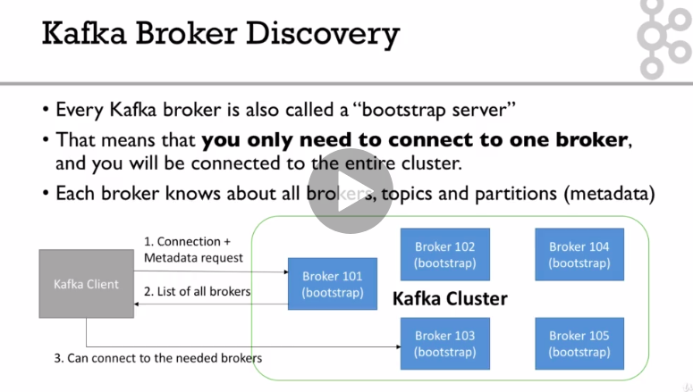

### Example   
[https://github.com/RyanGao67/Kafka_Learn_20210507/tree/master/code](https://github.com/RyanGao67/Kafka_Learn_20210507/tree/master/code)   
[https://github.com/RyanGao67/Kafka_Learn_20210507/tree/master/kafka-beginners-course-master](https://github.com/RyanGao67/Kafka_Learn_20210507/tree/master/kafka-beginners-course-master)

### Topics  
- Topic is a particular stream of data. (Similar to a table in database). You can have as many topics as you want.   
- A topic is identified by its name  
- Topics are split in partitions  
- Each partition is ordered  
- Each message within a partition gets an incremental id, called offset  
- When create a topic you have to specify how many partitions you have. 

### Brokers
- A Kafka cluster is composed of multiple brokers (servers)
- Each broker is identified with its ID (integer)
- Each broker contains certain topic partitions
- After connecting to any broker (called a bootstap broker), you will be connected to the entire cluster

### Topic replication factor  
- Topics should have a replication factor > 1 (usually 2 or 3, 3 is standard)

### Concept of Leader for a partition
- At anytime only one broker can be a leader for a given partition
- Only that leader can receive and serve data for a partition
- The other brokers will synchronize the data
- Therefore each partition has one leader and multiple ISR (in-sync replica)

### Producers
- Producers write data to topics (which is made of partitions)
- Producers automatically know to which broker and partition to write to (If you send without a key, producer will send the messages round-robin to partition 0, partition 1, partition 2)
- In case of Broker failures, Producers will automatically recover
* Producers can choose acks:
  * acks=0: Producer won't wait for acknowledgement (possible data loss)
  * acks=1: Producer will wait for leader acknowledgement (limited data loss)
  * acks=all: Leader + replicas acknowledgement (no data loss)
* Producers: Message keys
  * Producers can choose to send a key with the message (string, number, etc..)
  * If key=null, data is sent round robin (broker 101 then 102 then 103...)
  * If a key is sent, then all messages for that key will always go to the same partition
  * A key is sent if you need message ordering for a specific field 

### Consumers
* Consumers read data from a topic (identified by name)
* Consumers know which broker to read from
* In case of broker failures, consumers know how to recover
* Data is read in order within each partitions
* Consumer groups
  * Consumers read data in consumer groups
  * Each consumer within a group reads from exclusive partitions
  * If you have more consumers than partitions, some consumers will be inactive
* Kafka stores the offsets at which a consumer group has been reading
* The offsets committed live in a kafka topic named __consumer_offsets
* When a consumer in a group has processed data received from kafka, it should be committing the offsets
* If a consumer dies, it will be able to read back from where it left off thanks to the committed consumer offsets
* Delivery semantics for consumers
  * At most once: offsets are committed as soon as the message is received. If the processing goes wrong, the message will be lost (it won't be read again)
  * At least once: offsets are committed after the message is processed. If the processing goes wrong the message will be read again. this can result in duplicate processing of messages. Make sure your processing is idempotent. 
  * Exact once: Can only be achieved for Kafa to Kafka workflow using kafka streams API. For Kafka to external system workflows, use an idempotent consumer


  

### Download and Setup Java 8 JDK:

sudo apt install openjdk-8-jdk   
### Download & Extract the Kafka binaries from 
[https://kafka.apache.org/downloads](https://kafka.apache.org/downloads)

### Try Kafka commands using bin/kafka-topics.sh (for example)

### Edit PATH to include Kafka (in ~/.bashrc for example) 
PATH="$PATH:/your/path/to/your/kafka/bin"

### Edit Zookeeper & Kafka configs using a text editor

zookeeper.properties: dataDir=/your/path/to/data/zookeeper

server.properties: log.dirs=/your/path/to/data/kafka

### Start Zookeeper in one terminal window: 
zookeeper-server-start.sh config/zookeeper.properties

### Start Kafka in another terminal window: 
kafka-server-start.sh config/server.properties

Important: For the rest of the course, don't forget to add the extension .sh to commands being run

### kafka topic
```
kafka-topics --zookeeper 127.0.0.1:2181 --topic first_topic --create --partitions 3 --replication-factor 1
kafka-topics --zookeeper 127.0.0.1:2181 --list
kafka-topics --zookeeper 127.0.0.1:2181 --topic first_topic --describe
kafka-topics --zookeeper 127.0.0.1:2181 --topic second_topic --create --partitions 6 --replication-factor 1
kafka-topics --zookeeper 127.0.0.1:2181 --list
kafka-topics --zookeeper 127.0.0.1:2181 --topic second_topic --delete
```
*Pay attention to this error, the number of replication-factors larger than avaible brokers*
```
kafka-console-producer --broker-list 127.0.0.1:9092 --topic first_topic
kafka-console-producer --broker-list 127.0.0.1:9092 --topic first_topic --producer-property acks=all
kafka-console-producer --broker-list 127.0.0.1:9092 --topic new_topic   // no such topic
kafka-topics --zookeeper 127.0.0.1:2181 --list
kafka-topics --zookeeper 127.0.0.1:2181 --topic new_topic --describe
```

```
kafka-console-consumer --bootstrap-server 127.0.0.1:9092 --topic first_topic
kafka-console-consumer --bootstrap-server 127.0.0.1:9092 --topic first_topic --from-beginning
kafka-console-producer --broker-list 127.0.0.1:9092 --topic first_topic 
```

```
kafka-console-consumer --bootstrap-server 127.0.0.1:9092 --topic first_topic --group my-second-application --from-beginning
kafka-console-consumer --bootstrap-server 127.0.0.1:9092 --topic first_topic --group my-second-application 

```


```
kafka-consumer-groups --bootstrap-server localhost:9092 --list
kafka-consumer-groups --bootstrap-server localhost:9092 --describe --group my-second-application
kafka-consumer-groups --bootstrap-server localhost:9092 --describe --group my-first-application
kafka-console-consumer --bootstrap-server localhost:9092 --topic first_topic --group my-first-application
```


```
kafka-consumer-groups --bootstrap-server localhost:9092 --group my-first-application --reset-offsets --to-earliest --execute --topic first_topic

kafka-console-consumer --bootstrap-server 127.0.0.1:9092 --topic first_topic --group my-first-application
```

### Producers Acks Deep Dive 
acks = 0 (no acks)
* No response is requested
* If the broker goes offline  or an exception happens, we won't know and will lose data
Producer --->  Broker 101 Partition 0 (Leader) 0|1|2|3|4|... --->
* Useful for data where it's okay to potentially lose messages:
  * Metrics collection
  * Log collection

acks = 1 (leader acks)
* Leader response is requested, but relication is not a guarantee(happens in the background)  
* If an ack is not received, the producer may retry   
producer---> broker 101 partition 0 (leader)  0|1|2|3|4...----->
        <---     
        
* If the leader broker goes offline but replicas haven't relicated the data yet, we have a data loss. 


acks = all(replicas acks)
* Leader + replicas ack requested  
* Added latency and safety  
* min.insync.replicas  
* Acks=all must be used in conjuction with min.insync.replicas  
* min.insync.replicas can be set at the broker or topic level (override).   
* min.insync.replicas=2 implies that at least 2 brokers that are ISR(including leader) must respond that they have the data.   
* That means if you use replication.factor=3, min.insync=2, acks=all, you can only tolerate one breker going down, otherwise the producer will receive an exception on send.    


### Producer Retries  
* In case of transient failures, developers are expected to handle exceptions, otherwise the data will be lost.   
* Example of transient failure: NotEnoughReplicasException    
* There is a "retries" setting: default to 0 for kafka<=2.0    
* The retry.backoff.ms setting is by default 100ms

### Producer Timeouts
* If reties>0, for example retries = 2147483647   
* the producer won't try the request for ever, it's bounded by a timeout   
* For this, you can set an intuitive Producer Timeout   
* delivery.timeout.ms = 120000 ms == 2 minutes   
* records will be failed if they can not be acknowledges in delivery.timeout.ms   

### Producer Retries: Warning  
* In case of retries, there is a chance that the message will be sent out of order(If a batch has failed to be sent)    
* If you rely on key-based ordering, that can be an issue.   
* For this, you can set the setting while controls how many produce requests can be made in parallel: max.in.flight.requests.per.connection
* default:5  
* Set it to 1 if you need to ensure ordering(may inpact throughput)

### Idemponent Producer
* Idempotent producers are great to guarantee a stable and safe pipeline
* They come with :
  * retries = Integer.MAX_VALUE(2^31-1)
  * max.in.flight.requests=1(Kafka==0.11) or 
  * max.in.flight.requests=5(Kafka>=1.0 - higher performance & keep ordering)
