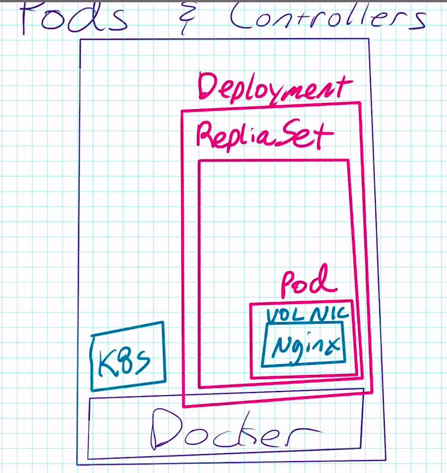
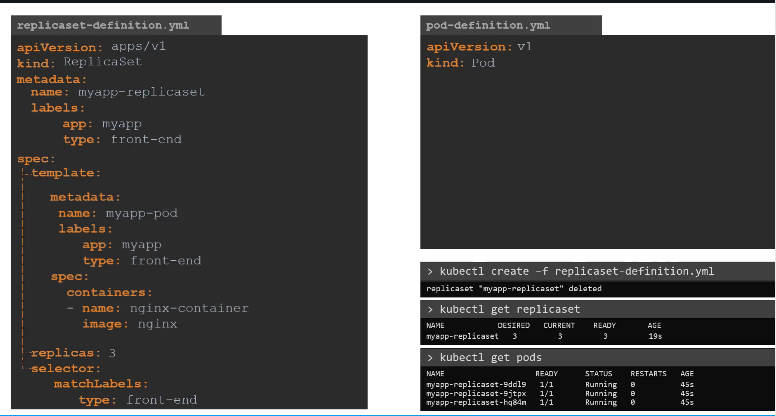

### How to download docker 
* visit https://get.docker.com
* There should be some command like ```curl -fsSL https://get.docker.com -o get-docker.sh```
* and ```sh get-docker.sh```
* Google docker compose and docker machine install, and then go to the github to get the most recent version
* run ```docker version```,  ```docker-machine version```,  ```docker-compose version``` to verify installation

### What is image and what is container
* An image is the application we want to run 
* A container is an instance of that image running as a process(a run time instance of an image -- what the image becomes in memory when executed -- an imgge with state, a user process)
* Docker's default image registry is call docker hub
* ```ps aux``` show me all running process


### Docker vs VM


## Run docker container commands basic
*  ```docker container run``` always starts new container, use ```docker container start``` to start an existing stopped one
* ```docker container run --publish 80:80 --detach --name webhost nginx```
* ```docker container run -d -p 3386:3386 --name db -e MYSQL_RANDOM_ROOT_PASSWORD=yes mysql``` => use ```--env``` to pass in ```MYSQL_RANDOM_ROOT_PASSWORD=yes``` and then use ```docker container logs db``` to find password 
* with mysql image , as you can read on docker hub have to specify one of 3 options. 1 specify a password 2 use no password 3 -e MYSQL_RANDOM_ROOT_PASSWORD=true
* ```docker container stats``` => show live performance data for all containers
* ```docker container inpect mysql``` => show metadata about the container , startup config, volumns, networking etc)
* ```docker container run -it --name proxy nginx bash``` => ```-t``` and ```--tty``` are pseudo-tty that simulates a real terminal, like SSH. ```-i``` and ```--interactive```means keeping session open to receive terminal input. ```bash``` is the command line default input when container spins up 
* ```docker container run -it --name ubuntu ubuntu```
* ```docker container start -ai ubuntu``` => start a existing one
* ```docker container exec -it mysql bash``` => execute a running docker container eg, detached container. This will start a new process from the running process of the container
* ```docker container logs webhost``` => logs in webhost
* ```docker container top webhost``` => list process in specific container 
* ```docker container ls -a``` => list all the containers 
* ```docker container rm 63f 690 0de``` => remove the container -f to force remove
* ```docker image ls``` list images locally
* ```docker container stop $(docker container ls -aq)```, ```docker container rm $(docker container ls -aq)``` => -q means numeric ID
* ```docker pull alpine``` , ```docker image ls``` pull a image from docker hub
* You can use "prune" commands to clean up images, volumes, build cache, and containers. Examples include:

- ```docker image prune``` to clean up just "dangling" images

- ```docker system prune``` will clean up everything

- The big one is usually ```docker image prune -a``` which will remove all images you're not using. Use ```docker system df``` to see space usage.

Remember each one of those commands has options you can learn with --help.

### Docker volumn
```sudo docker container run --name website -v $(pwd):/usr/share/nginx/html -d -p 3001:80 nginx ```

```sudo docker container run --name website-copy --volumns-from website -d -p 8081:80 nginx```

### Assignment:CLI App Testing
* Use different Linux distro containers to check curl cli tool version
* Use two different terminal windows to start bash in both centos:7 and ubuntu:14.04, using -it
* Learn the docker container --rm option so you can clean up
* Ensure is installed and on latest version for that distro
  * ubuntu: apt-get update && apt-get install curl
  * centos: yum update curl
 * Check curl --version   
 ```
docker container run --rm --it centos:7 bash
yum update curl
curl --version
docker container run --rm --it ubuntu:14.04 bash
curl --version
```

### Docker network
* Each container connected to a private virtual network which is also called "bridge"
* Each virtual network routes through NAT firewall on host IP
* All containers on a virtual network can talk to each other without -p
* When starting a container, you're in the background connecting to a particular Docker network. Bu default, that is the bridge network. Each one of those networks that would connect to actually route out through a NAT firewall, which is the docker daemon configuring the host IP baddress on its default interface so that your container can get to the rest of your network and get back
* ```docker container run -p 80:80 --name webhost -d nginx``` -d is always is host:container format
* ```docker container port webhost``` shows which ports are forwarding traffic to that container from the host into container itself
* ```docker container inspect --format '{{.NetworkSettings.IPAddress}}' webhost``` search format log docker to see document
* ```docker network ls``` list network
* ```docker network inspect bridge``` list containers in this bridge network
* ```docker network create my_app_net``` (Here it creates a new virtual network with a driver of bridge which is the default driver. Network driver is the built-in or 3rd party extensions that give you virtual network features). Bridge driver is a simple driver that creates a virtual network locally with its own subnet somewhere around 172.17 , 18, 19, 20)
* ```docker container inspect my-app-net```
* docker network disconnect <tab> <tab> (first tab => network, second tab=> container)
* docker network connect <tab><tab> 
* docker use container name as the equivalant of a hostname for containers to talk to each other, because docker DNS docker daemon has a built-in NDS server that containers use by default


### Assignment: DNS Round Robin Test
* Ever since Docker Engine 1.11, we can have multiple containers on a created network respond to the same DNS address
* Create a new virtual network (default bridge driver)
* Create two containers from elasticsearch:2 image
* Research and use --network-alias search when creating them to give then an additional DNS name to respond to 
* Run alpine nslookup search with --net to see the two containers list for the same DNS name
* Run centos curl -s search:9200 with --net multiple times until you see both "name" fields show

```
docker network create dude
docker container run -d --net dude --net-alias search elasticsearch:2
docker container run -d --net dude --net-alias search elasticsearch:2   // two container with the same alias
docker container ls 
docker container run --rm --net dude alpine nslookup search
docker container run --rm --net dude centos curl -s search:9200
docker container run --rm --net dude centos curl -s search:9200
docker container run --rm --net dude centos curl -s search:9200
```

### Assignment: build your own image 
* Dockerfiles are part process workflow and part art
* Take existing Node.js app and dockerize it 
* Make Dockerfile. Build it. Test it. Push it. (rm it ). Run  it.
* Details in dockerfile-assignment-1/Dockerfile
* Use the Alpine version of the official 'node' 6.x image
* Expected result is web site at http://localhost
* Tag and push to your docker hub account
* remove your image from local cache, run again from hub

```
# Instructions from the app developer
# - you should use the 'node' official image, with the alpine 6.x branch
FROM node:6-apline
# - this app listens on port 3000, but the container should launch on port 80 so it will reponse to http://localhost:80 on your computer
EXPOSE 3000
# - then it should use alpine package manager to install tini:'apk add --update tini'
RUN apk add --update tini
# - then it should create directory /usr/src/app for app files with 'mkdir -p /usr/src/app'
RUN mkdir -p /usr/src/app
# - Node uses a "package manager", so it needs to copy in packet.json file
WORKDIR /usr/src/app
# - then it needs to run 'npm install' to install dependencies from that file
COPY package.json package.json
# - to kepp it clean and small, run "npm cache clean" after above
RUN npm install && npm cache clean
# - then it needs to copy in all files from current directory
# - then it needs to start container with command 'tini -- node ./bin/www'
COPY ..
CMD ["tini","--","node","./bin/www"]
# - in the end your should be using FROM, RUN, WORKDIR, COPY, EXPOSE, and CMD commands
```

```docker build -t testnode .```  
```docker container run --rm -p 80:3000 testnode ```
```docker images```
```docker tag testnode bretfisher/testing-node:part2``` => username/repo:tag
```docker push bretfisher/testing-node:part2 ```
```docker image rm bretfisher/testing-node```
```docker container run --rm -p 80:3000 bretfisher/testing-node```


### Docker CICD
[https://docker.events.cube365.net/docker/dockercon/content/Videos/NjnEcHsq29HMDbMRn](https://docker.events.cube365.net/docker/dockercon/content/Videos/NjnEcHsq29HMDbMRn)


### Docker file

```sudo docker build --tag website:latest .``` 

This is the dockerfile   
```
FROM nginx:latest                                                         
Add . /usr/share/nginx/html
```


### K8S


### K8S components
volumns pod service ingress configMap secrets deployment statefulset

* Kubernetes: The whole orchestration system
* Kuberctl: CTL to configure Kubernetes and manage apps
* Node: single server in the kubernetes cluster
* kubelet:kubelet is the container that will run a small little agent on each node to allow that node to talk back to kubernetes master
* Control Plane: Set of container that manage the cluster
  * Include API server, scheduler, controller manager, etcd, and more
  * sometimes called master
  
* Inside of each master, we're going to need to run multiple containers to keep control of the system. 
  * The first of that is etcd. etcd is a distributed storage system for key values. 
  * API
  * Scheduler
  * controller manager
  * Core DNS
  
* Node
  * all the nodes they're going to need an agent running that is known as kubelet
  * you'll need kube-proxy to control the networking


### Kubernetes Container Abstractions
* Pod: one or more containers running together on one Node 
  * Basic unit of deployment. Containers are always in pods
  
* Controller: For creating / updating pods and other objects
  * Many types of controllers Deployment, ReplicaSet, StatefulSet, DaemonSet, Job, CronJob, etc.

* Service: network endpoint to connect to a pod
* Namespace: Filtered group of objects in cluster 
* Secrets, configMaps, and more

> kubectl run (changing to be only for pod creation)   
```
sudo microk8s.kubectl version
```  

```
sudo microk8s.kubectl run my-nginx --image nginx
```

```
sudo microk8s.kubectl get all
```

```
sudo microk8s delete deployment my-nginx
```
When you're using the run as it is right now in Version 1.14, it is technically using a Deployment controlle. That Deployment controller creates a ReplicaSet controller. That ReplicateSet controller then creates the pods. In this case, it's just one replica. So, it's only one pod.
> kubectl create (create some resources via CTL or YAML)      
> kubectl apply (create/update anything via YAML)





Depending on which version of Kubernetes you have installed, you'll need to decide how you'll create objects. Here's a cheat sheet for how old commands should be used with the 1.18 changes.

kubectl run nginx --image nginx created a Deployment named nginx before 1.18 (which creates a ReplicaSet, which creates a Pod)

kubectl run nginx --image nginx creates a Pod named nginx in 1.18+

Creating a Deployment in 1.18: kubectl create deployment nginx --image nginx


```
kubectl scale deploy/my-apache --replicas 2
kubectl scale deployment my-apache --replicas 2
```

deploy/my-apache: 
Type of deployment (also called deployment) 


Inspect/ describe
* The nice thing here is when you use the kubectl run command, it automatically added a label of the name of the Deployment to all these pods. So, we can use that same Deployment name my Apache for selecting all the pods with that label.

```
kubectl logs -l run=my-apache
```

Use -l to specify the label that the run command applied which is my-apache

* `kubectl get pods`

* `kubectl logs deployment/my-apache --follow --tail --tail 1`

* `kubectl describe pod/my-apache-xxxx-yyyy`

* `kubectl get pods -w`

* `kubectl delete pod/my-apache-xxxx-yyyy`


Let's start with Nodes and Node is a machine, physical or virtual one which Kubernetes is installed 

Node is a worker machine and that is where containers will be launched by Kubernetes, It was also known as minion's in the past. So you might hear these terms used interchangeably. 

But what if the node on which your application is running fails? Well obviously our application goes down. So you need to have more than one Node. A Cluster is a set of nodes grouped together, this way even if one node fails you have your application still accessible from the other Nodes. Moreover having multiple nodes helps in sharing load as well.

Now we have a cluster. But who is responsible for managing the cluster? Where is the information about members of the cluster stored.

How were the Nodes monitored? When a node fails how do you move the workload of the failed node to another worker node? That's where the Master comes in.

The Master is another node with Kubernetes installed in it and is configured as a Master. The Master watches over the Nodes in the cluster and is responsible for the actual orchestration of containers on the worker Nodes. When you install Kubernetes on a system you're actually installing the following components - An API server. An ETCD service. A kubelet service. A Container Runtime, Controllers and Schedulers.

* The API server acts as the front end for Kubernetes, the users, management devices, command line interfaces all talk to the API server to interact with Kubernetes cluster.

* Next is the ETCD key store. ETCD is a distributed reliable key-value store used by Kubernetes to store all data used to manage the cluster. Think of it this way. When you have multiple Nodes and multiple Masters in your cluster, ETCD stores all that information of all the nodes in the cluster in a distributed manner.
ETCD is responsible for implementing locks within the cluster to ensure that there are no conflicts between
the Masters. 

* The scheduler is responsible for distributing work or containers across multiple nodes it looks for newly created containers and assigns them to nodes.

* The controllers are the brain behind orchestration. They are responsible for noticing and responding when nodes, containers or end points goes down. The controllers make decisions to bring up new containers in such cases.

* The container runtime is the underlying software that is used to run containers. In our case it happens to be Docker, but there are other options as well.

* And finally Kubelet is the agent that runs on each node in the cluster. The agent is responsible for making sure that the containers are running on the nodes as expected.

So far we saw two types of servers. Master and Worker and a set of components that make up Kubernetes. But how are these companies distributed across different types of servers. In other words how does one server become a master and the other the slave. The worker node or minion as it is also known is where the containers are hosted.To run Docker containers on a system we need container runtime installed. And that's where the container runtime falls. In this case it happens to be Docker. 

The master server has the Kube API server and that is what makes it a master. Similarly the worker nodes have to Kubelet agent that is responsible for interacting with a master to provide health information of the worker node and carry out actions requested by the Master on the worker nodes.

All the information gathered are stored in a key value store on the master. The key value store is based on the popular ETCD framework as we just discussed. The master also has the control manager and the scheduler.
There are other components as well but we will stop there for now.

kube control tool is used to deploy and manage applications on a Kubernetes cluster to get cluster information to get the status of other Nodes in the cluster and to manage many other things. the kubectl run command is used to deploy an application on the cluster. The kubectl cluster info command is used to view information about the cluster and the kubectl get nodes command is used to list all the nodes part of the cluster.


# YAML in kubernetes
pod-definition.yml
```
apiVersion: v1
kind: Pod
metadata:
  name: myapp-pod
  labels:
    app: myapp
    type: front-end
spec:
  containers:
    - name: nginx-container
      image: nginx
```

|Kind|Version|
|----|-------|
|POD |v1     |
|Service|v1|
|ReplicaSet|apps/v1|
|Deployment|apps/v1|

```
kubectl get pods    // get all the pods
kubectl describe pod myapp-pod  // get detailed information
kubectl delete deployment nginx // delete pods
kubectl delete pod webapp // delete pods
kubectl create -f pod-definition.yml // create pod
kubectl get pods -o wide // get more detailed information

```

Example:
```
controlplane $ kubectl get pod webapp
NAME     READY   STATUS             RESTARTS   AGE
webapp   1/2     ImagePullBackOff   0          76s
```

We can see here there are two container in this pod webapp. 

# Create a pod yml from command line
```
kubectl run redis --image=redis123 --dry-run=client -o yaml > pod.yaml
```

# Update the pod 
```
kubectl edit pod redis 
```

# Replication controller (one of the controller)
Replication controller is replaced by replica set 


# How to scale replica 
1. Change the replica yaml, eg, replicas:6 . And then run `kubectl replace -f replicaset-definition.yml`

2. `kubectl scale --replicas=6 -f replicaset-definition.yml`  ----> this will not update the file

3. `kubectl scale --replicas=6 replicaset myapp-replicaset`  ----> the last two parameters are TYPE and NAME

4. this is for editing. `kubectl edit replicaset new-replica-set`  ----> the last parameter is the replicaset name

# Replicasets

```
// get replicasets
kubectl get replicasets

// eg

controlplane $ kubectl get replicasets
NAME            DESIRED   CURRENT   READY   AGE
new-replica-set 4         4         0       12s

// describe replicaset
kubectl describe replicaset new-replica-set
```

# Deployment


```
kubectl get all 
```

This will return the replica, pods, deployment

Example:

```
apiVersion: apps/v1
kind: Deployment
metadata:
  name: deployment-1
spec:
  replicas: 2
  selector:
    matchLabels:
      name: busybox-pod
  template:
    metadata:
      labels:
        name: busybox-pod
    spec:
      containers:
        - name: busybox-container
          image: busybox888
          command: 
            - sh
            - "-c"
            - echo Hello Kubernetes! && sleep 3600
```


# Namespace 
1. create a namespace

```
apiVersion: v1
kind: Namespace
metadta:
  name: dev
```

and then run this : `kubectl create -f namespace-dev.yml`

another approach is to `kubectl create namespace dev`


2. create a pod and run in a given namespace
```
kubectl run redis --image=redis --dry-run=client -o yaml > pod.yaml
```

3. find the pod in all namespaces

```
kubectl get pods --all-namespaces | grep blue
```

4. What DNS name should the Blue application use to access the database 'db-service' in the 'dev' namespace


db.service.dev.svc.cluster.local

# Imperative commands

While you would be working mostly the declarative way - using definition files, imperative commands can help in getting one time tasks done quickly, as well as generate a definition template easily. This would help save a considerable amount of time during your exams.

Before we begin, familiarize with the two options that can come in handy while working with the below commands:

`--dry-run`: By default as soon as the command is run, the resource will be created. If you simply want to test your command, use the --dry-run=client option. This will not create the resource, instead, tell you whether the resource can be created and if your command is right.

`-o yaml`: This will output the resource definition in YAML format on the screen.


Use the above two in combination to generate a resource definition file quickly, that you can then modify and create resources as required, instead of creating the files from scratch.

**POD**
Create an NGINX Pod

`kubectl run nginx --image=nginx`

Generate POD Manifest YAML file (-o yaml). Don't create it(--dry-run)

`kubectl run nginx --image=nginx  --dry-run=client -o yaml`


**Deployment**   
Create a deployment

``kubectl create deployment --image=nginx nginx``

Generate Deployment YAML file (-o yaml). Don't create it(--dry-run)

`kubectl create deployment --image=nginx nginx --dry-run -o yaml`

Generate Deployment with 4 Replicas

`kubectl create deployment nginx --image=nginx --replicas=4`

You can also scale a deployment using the kubectl scale command.

`kubectl scale deployment nginx --replicas=4`

Another way to do this is to save the YAML definition to a file.

`kubectl create deployment nginx --image=nginx--dry-run=client -o yaml > nginx-deployment.yaml`

You can then update the YAML file with the replicas or any other field before creating the deployment.

**Service**
Create a Service named redis-service of type ClusterIP to expose pod redis on port 6379

`kubectl expose pod redis --port=6379 --name redis-service --dry-run=client -o yaml`

(This will automatically use the pod's labels as selectors)

Or

`kubectl create service clusterip redis --tcp=6379:6379 --dry-run=client -o yaml`  (This will not use the pods labels as selectors, instead it will assume selectors as app=redis. You cannot pass in selectors as an option. So it does not work very well if your pod has a different label set. So generate the file and modify the selectors before creating the service)

Create a Service named nginx of type NodePort to expose pod nginx's port 80 on port 30080 on the nodes:

`kubectl expose pod nginx --port=80 --name nginx-service --type=NodePort --dry-run=client -o yaml`

(This will automatically use the pod's labels as selectors, but you cannot specify the node port. You have to generate a definition file and then add the node port in manually before creating the service with the pod.)

Or

`kubectl create service nodeport nginx --tcp=80:80 --node-port=30080 --dry-run=client -o yaml`

(This will not use the pods labels as selectors)

Both the above commands have their own challenges. While one of it cannot accept a selector the other cannot accept a node port. I would recommend going with the `kubectl expose` command. If you need to specify a node port, generate a definition file using the same command and manually input the nodeport before creating the service.


