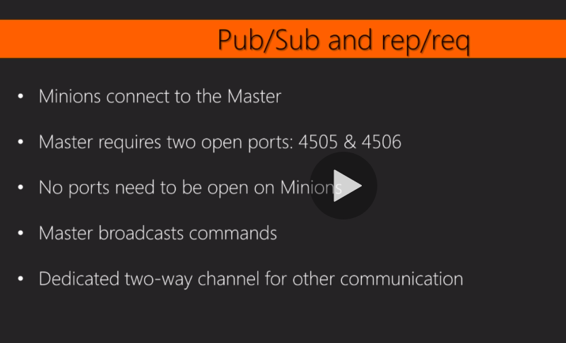
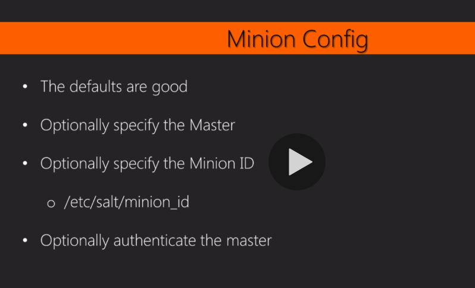
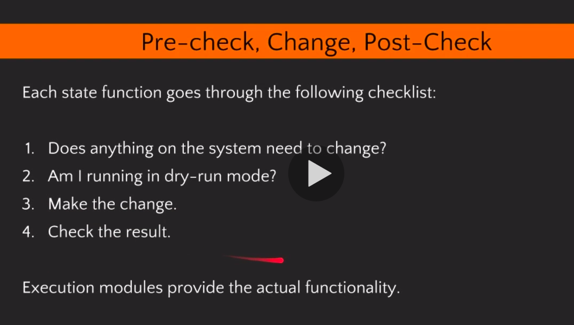
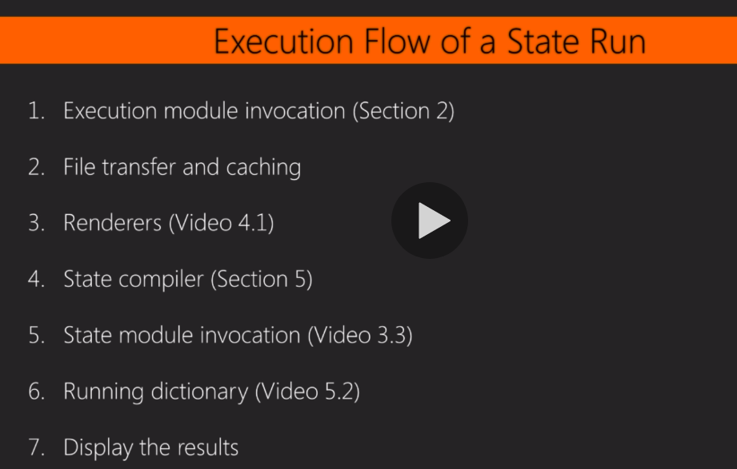

### Why salt?
* Fast enough that it doesn't require cached data or a database

* Distributed work to the Minions

* Constant network connection

* Fast encryption everywhere

* it is generic communication bus ---- useful for remote execution, state enforcement, more

* it has deterministic execution order ---- deterministic execution order,     ----states always run in the same order  

### Network topology

* master/minion

* it uses zeroMQ connection between all of those systems (use pub/sub and rep/req)

* Message over this zeroMQ tube connection are serialized and compressed using a library called messagepack(like json) 




### Transports

* ZeroMQ is the default

* Raw TCP transport provided by tornado

* HTTPS via salt-api

### Default master configuration


```
vi /etc/salt/master
```

* In general you can run the salt master as a non-root user because the master is sending messages to minions, but if you need to use salt to configure programmatically set up the salt master machine, you're going to want to keep user as root

### Minion config 




```
vi /etc/salt/minion
```


### Configuration directories

* Most of the packages (centos or ubuntu)will create /etc/salt/master.d or /etc/salt/minion.d automatically

* what they do is it will read all the conf file in that directory and load them all up 

* it is nice way to store all of the defaults in the main salt configuration and then just store your overrides in a conf file

For example: 

```

vi /etc/salt/minion.d/local.conf
```


in this file put 

```
master:192.168.56.101
id:jerry
```


```
service salt-minion restart
```

```
systemctl start salt-master
```

```
systemctl start salt-minion
```


### sdb

Salt is made of many pluggable interfaces. sdb is one of those. 
* One of the nice things about sdb is sdb values can be encrypted and they can be pulled into the salt configuration files and those settings are referenced or are decrypted or are looked up at the time that they are referenced, Not when the daemon is loaded. 

for example:
in the prevous local.conf file put in this :
```
mysecretsetting: sdb://lookup/path/here
```


### Authentication

* it uses public and private RSA keypairs

* it is a SSH handshake algorithm on top of zeroMQ  

* Masters and Minions generate keys on startup and then they do the public key exchange same as SSH does

* in /etc/salt/pki  master.pem is the private key ,   master.pub key is the public key other folders is to store the public key from minions


* then first time minion connects to the master, the minion send the public key to the master and the master accept the public key

* so if you're troubleshooting something or if you need to swap out the key, you need to delete on both minion and master 


### Encryption

* salt uses AES standard

* Rotating AES key every 24 hours and after a minion key is deleted or rejected

Salt uses this to create an encrypted pub sub connection 

So when that publish goes out to minions, that publish is encrypted using this key

and in order to deauthenticate a minion if you delete a minion's key then after you delete that key, salt will then rotate that key. So all of the other minions will authenticate and pick up that new key so that they can decrypt those publishes

* salt key is the interface to accessing all of these key management facilities

* One thing that we have to do with our system: centos sets up a firewall so we have to poke a hole in that firewall for the master port. To turn off firewall: iptables -F


* to  debug, take a look at /var/log/salt/minion

* consult help:

```		
salt-key -h
```

* accept keys 

```
salt-key -A
```


### Targeting


```
sudo salt -L jerry test.ping
```

```
sudo salt '*' test.ping
```


```
salt -G os_family:RedHat test.ping
```

```
salt -C 'G@os_family:RedHat and stu*' test.ping
```


### Grains

* grains are static information concerned about each minion as the minion daemon starts up. 

* (on minion) python functions ask the local system and return a little dictionary about whatever it is they query and that is combined into a larger dictionary of information about that system

* they are generated when the minion starts and they are kept in memory on the minion. they are also shipped up to the master and the master keeps a cache of them so that master can perform some out-of-band checks

List:    
```
sudo salt-call --local grains.items
```

Add: 
```
salt-call --local grains.setval foo Foo
```


### Flow vs state

* Flow is something ephemeral (it is something you run and it changes the system right now and the change isn't really tracked or enforced)

* State is enforcing the state of a system over time

* broadly flow and state are represented and solved as execution modules and state modules (execution modules are python functions in python modules, all the python functions return json serializable data)


### salt loader 

salt has what's called a loader. the salt loader is responsible for loading all of these module types

So the salt loader goes through and decides which one of these modules are applicable to the underlying operating system. (the modules are loaded into memory based on that)


### salt is pluggable system

* the core is a tiny little thing that maintains a always-on encrypted high speed communication channel and then surrounding salt is just a ton of pluggable interfaces(each pluggable interfaces has a corresponding module type). 


### Common salt modules

* Example: common execution modules(pkg, user, service, status, test, cmd, grains);  Salt internals as execution modules(match, cp)


```
salt jerry sys.doc test.ping
```

This is calling out to jerry and grabbing that documentation from jerry

```
salt jerry sys.doc test | less

```

This will show all the documents for all of the functions in the test module


```
salt jerry sys.list_modules
```

List all the execution modules on jerry

```
salt jerry sys.list_functions | less 

```

List all the functions on jerry
```
salt jerry pkg.list_pkgs | less
```

this lists the packages currently installed on the minion 

Each one of the package modules queries the underlying operating system and whatever is the most efficient quickest way to get that data. (in case of a red hat system, it will call out to RPM, in case of windows it will consult windows registry)


```
sudo salt -L jerry,stuart pkg.list_pkgs --out=txt | grep wget | cut -c -20
```


```
salt stuart user.list_users
```

```
salt stuart user.getent root
```


```
salt stuart service.get_running
```


```
salt stuart status.uptime

salt -L stuart,jerry status.diskusage

salt -L stuart,jerry test.version // show salt version installed

salt -L stuart,jerry test.versions_report // show salt version and dependencies version

salt -L stuart,jerry cmd.run 'whoami'

salt -L stuart,jerry cmd.run 'ls /etc/salt'

salt -L stuart,jerry cmd.run 'cat /etc/salt/grains'

salt -L stuart,jerry cmd.run_all 'cat /etc/salt/grains'

salt -L stuart,jerry cmd.script salt://myscript.sh  //this command takes a salt file, it will transfer the script from master to each one of minions and then executes it locally and return the result
```


### Minion vs Master

in master
```
sudo salt '*' test.ping
```

in minion
```
salt-call test.ping
```

in minion
```
salt-call cmd.run 'ls /etc/salt'
salt-call cmd.run 'ls /etc/salt' -l debug
```


in minion
```
salt-call network.netstat 
salt-call network.netstat -l debug
```

in master
```
salt -L jerry,stuart test.arg foo bar=Bar baz='{qux:Qux}' quux=true
```

### State

* A single state or a full state run can be executed on a system many times in a row and the end-result will be the same

* each sls file is comprised of many state functions


* The minions are the ones that actually run the states, the work is distributed across all the minions which means the master is only responsible for sending out that initial commands and then transferring any files that the minions request to those minions and the minion themselves compile the state tree. 


//execution module(m in module index) vs state module (s in module index)


* State function returns a dictionary
  * Result
  * Changes
  * Comment

For example:

```
[centos@ip-172-31-15-51 salt]$ sudo salt jerry state.sls apache
jerry:
----------
          ID: install_apache
    Function: pkg.installed
        Name: apache2
      Result: True
     Comment: All specified packages are already installed
     Started: 18:33:32.708314
    Duration: 31.821 ms
     Changes:   
----------
          ID: start_apache
    Function: service.running
        Name: apache2
      Result: True
     Comment: The service apache2 is already running
     Started: 18:33:32.741704
    Duration: 38.484 ms
     Changes:   
----------
          ID: welcome_page
    Function: file.managed
        Name: /var/www/html/index.html
      Result: True
     Comment: File /var/www/html/index.html is in the correct state
     Started: 18:33:32.783872
    Duration: 12.138 ms
     Changes:   

Summary for jerry
------------
Succeeded: 3
Failed:    0
------------
Total states run:     3
Total run time:  82.443 ms

```


* What happened when execute an stage



(notice finally the execution module provide the functionality)

* layers of a state run and execution flow of a state run



### What happens after 

```
salt jerry state.sls apache
```

the minion will search locally first: do I have apache.sls? 

Just like using the following command:


```
salt jerry cp.cache_file salt://apache.sls

```

If it does: /var/cache/salt/minion/files/base/apache.sls,  it will compare the checksum


In one way or another the file will be in the minion cache. 

Then the file will go to salts renderer system which produces a data structure(high state data structure)

To show the high state data structure:

```
salt jerry state.show_sls apache
```


Then the high state data structure is handed to salts state compiler, the salt state compiler will produce a low state data structure. To show low state data structure:

```

salt jerry state.show_low_sls apache
```


the salt state compiler will read the state one by one and puts the results(for each state one by one) into what's called the running dictionary(in memory)

```
salt jerry state.sls apache // the print is the dictionary

```


### Debug

try to add this "-l debug"


### YAML, Jinja and Other Renderers

### Put custom logic inside of a custom execution model

```
mkdir /srv/salt/_modules
vi /src/salt/_modules/myutil.py

```

```python

def something():
	return 'something happended'
        return __salt__['cmd.run']('date')

```

```
salt '*' saltutil.sysnc_modules
salt '*' myutil.something
```

### One example
Using Jinja and yaml
```
# Manage Apache.






install_apache:
  pkg.installed:
    - name: {{ apache_pkg }}

start_apache:
  service.running:
    - name: {{ apache_pkg}}
    # Explicitly enable to start on boot because we need to manage
 centos as well
    - enable: True

welcome_page:
  file.managed:
    - name: /var/www/html/index.html
    - contents: |
        <!doctype html>
        <body><h1>helloworld</h1></body>

```

Slightly modify

```
# Manage Apache.





install_apache:
  pkg.installed:
    - name: {{ apache.pkg }}

start_apache:
  service.running:
    - name: {{ apache.pkg}}
    # Explicitly enable to start on boot because we need to manage
 centos as well
    - enable: True

welcome_page:
  file.managed:
    - name: /var/www/html/index.html
    - contents: |
        <!doctype html>
        <body><h1>helloworld</h1></body>


```


### Pillar 

Edit the following files:
```
[centos@ip-172-31-15-51 salt]$ sudo vi /srv/pillar/name.sls
[centos@ip-172-31-15-51 salt]$ sudo vi /srv/pillar/top.sls
```

refresh the pillar
```
 salt '*' saltutil.refresh
```

Each minion will send a request on the private channel to the master saying hey can I have my latest pillar.

The master then compiles pillar for that one requesting minion and it does so with the local cache that lives on the master, the minion's grains as well as the minion's ID and also a copy of the minion's configuration file.

And then it generates pillar And then it returns over that private channel a dictionary of those pillar values of those
rendered pillar values.

So the minion never gets access to these Salles files it just gets access to the resulting dictionary.

All of those as well as files are merged together into one big dictionary and then anything that comes in from external pillar again merged into that big dictionary not dissimilar from grains.

So the master compiles this once for each minion and then each minion keeps its own copy of pillar in memory.

So pillar is not appropriate for say large binary files because because it's kept in memory 

Pillar never touches disk on the minions(store using memory)


To override the information in file:
```
salt '*' state.sls apache.welcome pillar='{name: Override}'
```

### fileserver backend
in /etc/salt/master, edit the fileserver_backend:
```
fileserver_backend:
  - git
  - roots
```
also install gitpython on centos

```
sudo yum install GitPython
```

also add this to /etc/salt/master

```
gitfs_remotes:
  - https://github.com/saltstack-formulas/memcached-formula.git

```

After this you need to restart salt master

```
sudo systemctl restart salt-master
```

To verify: this is asking jerry to ask the master for all the files in its file root
```
sudo salt jerry cp.list_master
```

this shows all the sls file live in the file root
```
sudo salt jerry cp.list_states
```

### Debug

* This is debug.
```
sudo salt-call state.show_sls apache -l debug
```

* This is context.
```
# /srv/salt/show_context.sls
Context is: {{ show_full_context().keys() }}
```

```
sudo salt jerry state.show_sls show_context
```

* Context variables. 
```
output_jinja:
  file.managed:
    - name: /tmp/jinja_output
    - contents: | 
        My Jinja variable 'foo' is :
        {{ foo | json() }}
```


### Pillar vs Top

All that is avaiable to us from the top file are processed on the minion unlike with pillar where everything is processed on the Masters and just the resulting data structure sent to minions


### Execution steps 

* salt '*' match.glob '*' 
* salt '*' cp.cache_file salt://top.sls
* salt '*' state.show_top
* salt '*' state.show_highstate
* salt '*' state.highstate --out=json
