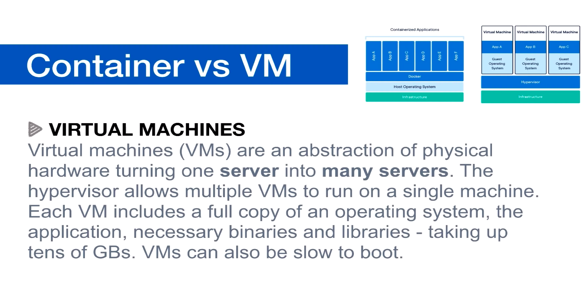
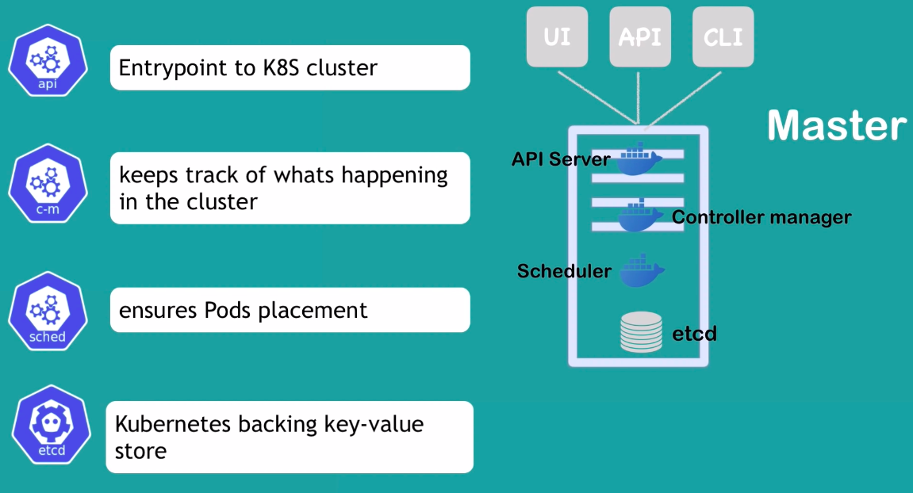
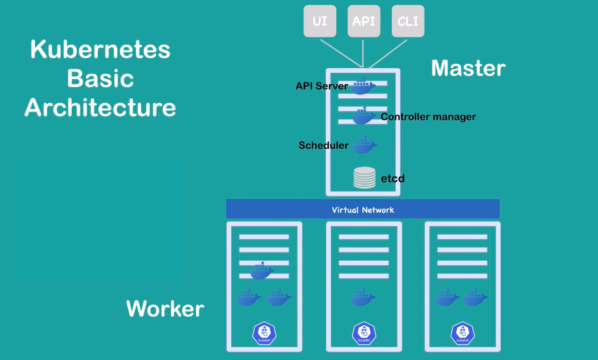

### How to download docker 
* visit https://get.docker.com
* There should be some command like ```curl -fsSL https://get.docker.com -o get-docker.sh```
* and ```sh get-docker.sh```
* Google docker compose and docker machine install, and then go to the github to get the most recent version
* run ```docker version```,  ```docker-machine version```,  ```docker-compose version``` to verify installation

### What is image and what is container
* An image is the application we want to run 
* A container is an instance of that image running as a process(a run time instance of an image -- what the image becomes in memory when executed -- an imgge with state, a user process)
* Docker's default image registry is call docker hub
* ```ps aux``` show me all running process


### Docker vs VM



## Run docker container commands basic
*  ```docker container run``` always starts new container, use ```docker container start``` to start an existing stopped one
* ```docker container run --publish 80:80 --detach --name webhost nginx```
* ```docker container run -d -p 3386:3386 --name db -e MYSQL_RANDOM_ROOT_PASSWORD=yes mysql``` => use ```--env``` to pass in ```MYSQL_RANDOM_ROOT_PASSWORD=yes``` and then use ```docker container logs db``` to find password 
* with mysql image , as you can read on docker hub have to specify one of 3 options. 1 specify a password 2 use no password 3 -e MYSQL_RANDOM_ROOT_PASSWORD=true
* ```docker container stats``` => show live performance data for all containers
* ```docker container inpect mysql``` => show metadata about the container , startup config, volumns, networking etc)
* ```docker container run -it --name proxy nginx bash``` => ```-t``` and ```--tty``` are pseudo-tty that simulates a real terminal, like SSH. ```-i``` and ```--interactive```means keeping session open to receive terminal input. ```bash``` is the command line default input when container spins up 
* ```docker container run -it --name ubuntu ubuntu```
* ```docker container start -ai ubuntu``` => start a existing one
* ```docker container exec -it mysql bash``` => execute a running docker container eg, detached container. This will start a new process from the running process of the container
* ```docker container logs webhost``` => logs in webhost
* ```docker container top webhost``` => list process in specific container 
* ```docker container ls -a``` => list all the containers 
* ```docker container rm 63f 690 0de``` => remove the container -f to force remove
* ```docker image ls``` list images locally
* ```docker container stop $(docker container ls -aq)```, ```docker container rm $(docker container ls -aq)``` => -q means numeric ID
* ```docker pull alpine``` , ```docker image ls``` pull a image from docker hub
* You can use "prune" commands to clean up images, volumes, build cache, and containers. Examples include:

- ```docker image prune``` to clean up just "dangling" images

- ```docker system prune``` will clean up everything

- The big one is usually ```docker image prune -a``` which will remove all images you're not using. Use ```docker system df``` to see space usage.

Remember each one of those commands has options you can learn with --help.

### Docker volumn
```sudo docker container run --name website -v $(pwd):/usr/share/nginx/html -d -p 3001:80 nginx ```

```sudo docker container run --name website-copy --volumns-from website -d -p 8081:80 nginx```

### Assignment:CLI App Testing
* Use different Linux distro containers to check curl cli tool version
* Use two different terminal windows to start bash in both centos:7 and ubuntu:14.04, using -it
* Learn the docker container --rm option so you can clean up
* Ensure is installed and on latest version for that distro
  * ubuntu: apt-get update && apt-get install curl
  * centos: yum update curl
 * Check curl --version   
 ```
docker container run --rm --it centos:7 bash
yum update curl
curl --version
docker container run --rm --it ubuntu:14.04 bash
curl --version
```

### Docker network
* Each container connected to a private virtual network which is also called "bridge"
* Each virtual network routes through NAT firewall on host IP
* All containers on a virtual network can talk to each other without -p
* When starting a container, you're in the background connecting to a particular Docker network. Bu default, that is the bridge network. Each one of those networks that would connect to actually route out through a NAT firewall, which is the docker daemon configuring the host IP baddress on its default interface so that your container can get to the rest of your network and get back
* ```docker container run -p 80:80 --name webhost -d nginx``` -d is always is host:container format
* ```docker container port webhost``` shows which ports are forwarding traffic to that container from the host into container itself
* ```docker container inspect --format '{{.NetworkSettings.IPAddress}}' webhost``` search format log docker to see document
* ```docker network ls``` list network
* ```docker network inspect bridge``` list containers in this bridge network
* ```docker network create my_app_net``` (Here it creates a new virtual network with a driver of bridge which is the default driver. Network driver is the built-in or 3rd party extensions that give you virtual network features). Bridge driver is a simple driver that creates a virtual network locally with its own subnet somewhere around 172.17 , 18, 19, 20)
* ```docker container inspect my-app-net```
* docker network disconnect <tab> <tab> (first tab => network, second tab=> container)
* docker network connect <tab><tab> 
* docker use container name as the equivalant of a hostname for containers to talk to each other, because docker DNS docker daemon has a built-in NDS server that containers use by default


### Assignment: DNS Round Robin Test
* Ever since Docker Engine 1.11, we can have multiple containers on a created network respond to the same DNS address
* Create a new virtual network (default bridge driver)
* Create two containers from elasticsearch:2 image
* Research and use --network-alias search when creating them to give then an additional DNS name to respond to 
* Run alpine nslookup search with --net to see the two containers list for the same DNS name
* Run centos curl -s search:9200 with --net multiple times until you see both "name" fields show

```
docker network create dude
docker container run -d --net dude --net-alias search elasticsearch:2
docker container run -d --net dude --net-alias search elasticsearch:2   // two container with the same alias
docker container ls 
docker container run --rm --net dude alpine nslookup search
docker container run --rm --net dude centos curl -s search:9200
docker container run --rm --net dude centos curl -s search:9200
docker container run --rm --net dude centos curl -s search:9200
```

### Assignment: build your own image 
* Dockerfiles are part process workflow and part art
* Take existing Node.js app and dockerize it 
* Make Dockerfile. Build it. Test it. Push it. (rm it ). Run  it.
* Details in dockerfile-assignment-1/Dockerfile
* Use the Alpine version of the official 'node' 6.x image
* Expected result is web site at http://localhost
* Tag and push to your docker hub account
* remove your image from local cache, run again from hub

```
# Instructions from the app developer
# - you should use the 'node' official image, with the alpine 6.x branch
FROM node:6-apline
# - this app listens on port 3000, but the container should launch on port 80 so it will reponse to http://localhost:80 on your computer
EXPOSE 3000
# - then it should use alpine package manager to install tini:'apk add --update tini'
RUN apk add --update tini
# - then it should create directory /usr/src/app for app files with 'mkdir -p /usr/src/app'
RUN mkdir -p /usr/src/app
# - Node uses a "package manager", so it needs to copy in packet.json file
WORKDIR /usr/src/app
# - then it needs to run 'npm install' to install dependencies from that file
COPY package.json package.json
# - to kepp it clean and small, run "npm cache clean" after above
RUN npm install && npm cache clean
# - then it needs to copy in all files from current directory
# - then it needs to start container with command 'tini -- node ./bin/www'
COPY ..
CMD ["tini","--","node","./bin/www"]
# - in the end your should be using FROM, RUN, WORKDIR, COPY, EXPOSE, and CMD commands
```

```docker build -t testnode .```  
```docker container run --rm -p 80:3000 testnode ```
```docker images```
```docker tag testnode bretfisher/testing-node:part2``` => username/repo:tag
```docker push bretfisher/testing-node:part2 ```
```docker image rm bretfisher/testing-node```
```docker container run --rm -p 80:3000 bretfisher/testing-node```


### Docker CICD
[https://docker.events.cube365.net/docker/dockercon/content/Videos/NjnEcHsq29HMDbMRn](https://docker.events.cube365.net/docker/dockercon/content/Videos/NjnEcHsq29HMDbMRn)


### Docker file

```sudo docker build --tag website:latest .``` 

This is the dockerfile   
```
FROM nginx:latest                                                         
Add . /usr/share/nginx/html
```


### K8S




### K8S components
volumns pod service ingress configMap secrets deployment statefulset

* Kubernetes: The whole orchestration system
* Kuberctl: CTL to configure Kubernetes and manage apps
* Node: single server in the kubernetes cluster
* kubelet:kubelet is the container that will run a small little agent on each node to allow that node to talk back to kubernetes master
* Control Plane: Set of container that manage the cluster
  * Include API server, scheduler, controller manager, etcd, and more
  * sometimes called master
  
* Inside of each master, we're going to need to run multiple containers to keep control of the system. 
  * The first of that is etcd. etcd is a distributed storage system for key values. 
  * API
  * Scheduler
  * controller manager
  * Core DNS
  
* Node
  * all the nodes they're going to need an agent running that is known as kubelet
  * you'll need kube-proxy to control the networking


### Kubernetes Container Abstractions
* Pod: one or more containers running together on one Node 
  * Basic unit of deployment. Containers are always in pods
  
* Controller: For creating / updating pods and other objects
  * Many types of controllers Deployment, ReplicaSet, StatefulSet, DaemonSet, Job, CronJob, etc.

* Service: network endpoint to connect to a pod
* Namespace: Filtered group of objects in cluster 
* Secrets, configMaps, and more

> kubectl run (changing to be only for pod creation)   
```
sudo microk8s.kubectl version
```  

```
sudo microk8s.kubectl run my-nginx --image nginx
```

```
sudo microk8s.kubectl get all
```
When you're using the run as it is right now in Version 1.14, it is technically using a Deployment controlle. That Deployment controller creates a ReplicaSet controller. That ReplicateSet controller then creates the pods. In this case, it's just one replica. So, it's only one pod.
> kubectl create (create some resources via CTL or YAML)      
> kubectl apply (create/update anything via YAML)


