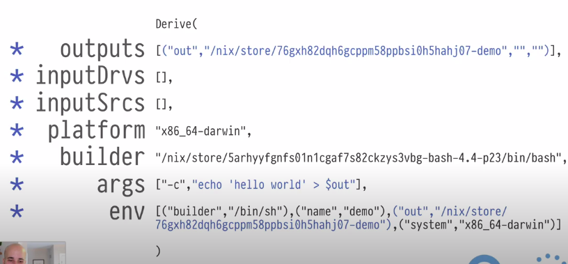
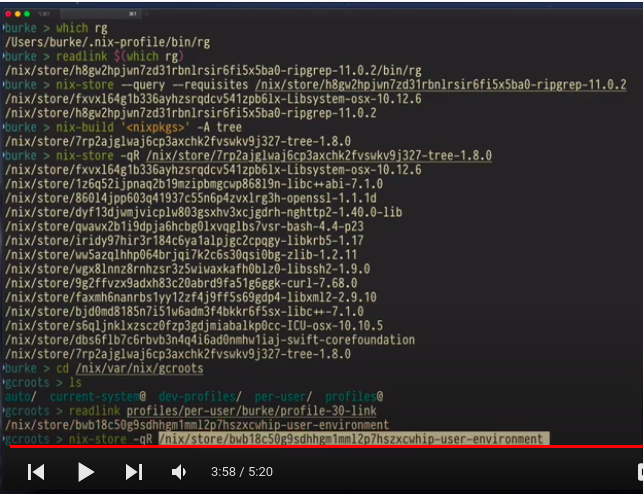

# Install

```
sudo su
curl -L https://nixos.org/nix/install | sh
. /root/.nix-profile/etc/profile.d/nix.sh
```

search on nix package search 

[https://search.nixos.org/packages?channel=unstable&show=ripgrep&from=0&size=50&sort=relevance&type=packages&query=ripgre](https://search.nixos.org/packages?channel=unstable&show=ripgrep&from=0&size=50&sort=relevance&type=packages&query=ripgre)


# Usage 1 like homebrew
to install package: 

```
nix-env -iA nixpkgs.ripgrep
nix-env --install --attr nixpkgs.tree
nix-env -q --installed
nix-env -e tree ripgrep
nix-env -e nss-cacert                      --------------
nix-env -iA nixpkgs.pstree
nix-env -iA nixpkgs.cacert                 --------------
nix-env --list-generations   -----> list nix-env profile
nix-env --rollback
nix-env --switch-generation 2
```

# Usage 2 run software without installing it

```
, rg "fail to start"

nix-env -q --installed                    ------------> rg is not installed

, ruby --version

# software installed is in /nix/store

, pstree
```


# Nix store

/nix/store :graph
/nix/store/* :nodes (immutable!)
e.g.: /nix/store/h1jmi5pnsjj8fjijgjsdfjsalfjsalkf-ruby-2.6.5

If a node includes references to paths in other nodes, those references constitute edges. 

* ruby-2.6.5 is the name. 

* h1jmi5pnsjjfjdslkfjlsakdjflsakdjflsakdjflas is the hash

For a given hash, the contents of that path will always be identical, across machines, platforms, etc

Nix is a graph database.  You can query it like a graph database. 

```
$ nix-store --query --references /nix/store/...-zlib-1.2.11
/nix/store/...-Libsystem-osx-10.12.6
/nix/store/...-zlib-1.2.11
```

```
# show graph dependency
# show me the transitive closure of dependencies of RUby
$ nix-store --query --graph /nix/store/...-rubu-2.6.5 | dot -Tsvg 
```


# Derivations

Derivation is the thing that puts stuff in the nix store. 

Special entries in nix store, describing how to build other entries in nix store. 

```
$ cat /nix/store/fjdsalfjalsdfjas-demo.drv
Derive([(..)],[],[],..........)
```

Everything in Nix store, except for derivations, is created using a derivation. 

In derivation, every direct dependency is mentioned in this .drv blob. 

A derivation is a recipe to build some other path in the nix store. 

nix-build /nix/store/fdsfasfd-demo.drv

/nix/store/jfldsafjalskdjflasjfdlsa-demo





```
cat /nix/store/fjdslafjsaldfjaldsfjlsa-demo

hello world
```

# Sandbox

* outputs
* inputDrvs
* inputSrcs
* platform
* builder
* args
* env

Only things mentioned in the derivation are available when building a derivation. Nix normally builds with a sandbox that actually prevents access to anything not declared, or outside of the Nix Store. 

A path's hash is derived from its derivation's hash, which is derived from all of this(outputs, inputDrvs, inputSrcs, platform, builder, args, env) 


Dependencies mush be made explicit, this makes them part of the output hash of the software being built. 


=====> So you can literally copy a Nix store closure from one machine to another and it runs the same. 

# Nix lang

Free of side effects
* no networking
* no user input
* no file writing
* no output(except some tracing)
* doesn't actually do anything

except when calling derivation function

```
derivation {
	name="demo";
        builder = "${bash}/bin/bash";
	args=["-c" "echo neat > $out"];
	system = "x86_64-darwin";
}

derivation {
        name="demo";
        builder = "${bash}/bin/bash";
        args=["-c" "echo neat > $out"];
        system = "x86_64-darwin";
	drvPath = "/nix/store/fjdslakfjlksajf-demo.drv";    ----> this is side effect a new file 
	outPath = "/nix/store/fjsalkfjsldfj-demo";
}
```

derivation 
 
a function all in nixlang which generates a /nix/store/... drv file. 

That file can be built with (e.g. nix-build). 

NixLang doesn't actually build - or do - anything at all other than create .drvs

# Garbage collection



```
nix-collect-garbage
```

nix-env -iA nixpkgs.tree    -----> because it creates a entry in nix root, it will no longer be garbage collect

# installation

https://nixos.org/guides/install-nix.html

```
source /etc/profile.d/nix.sh 

```
