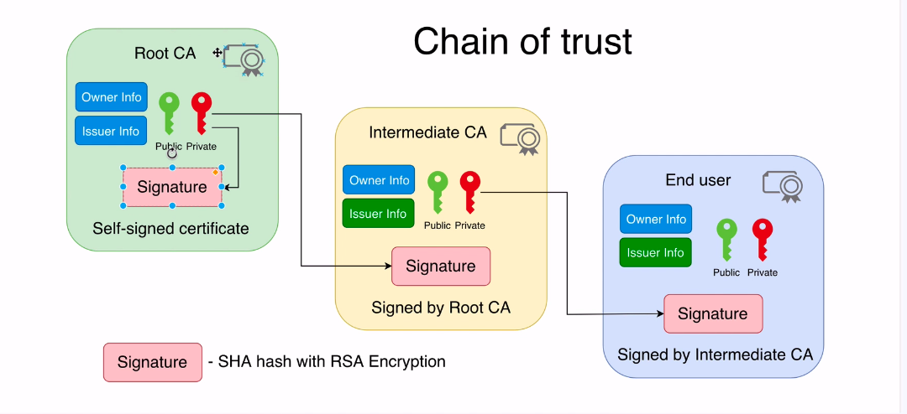
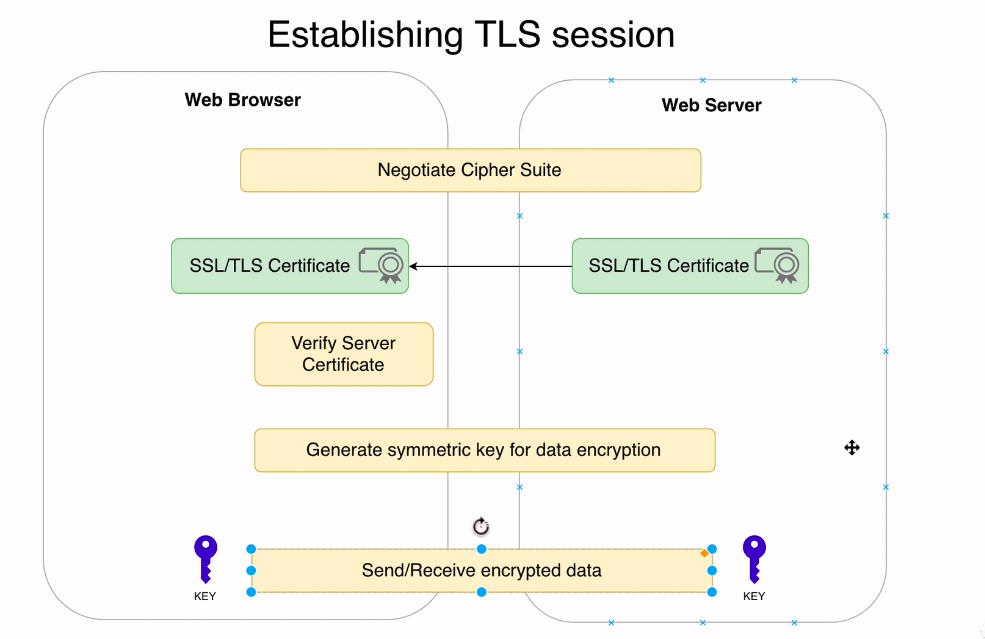

### openssl genarate key

openssl genrsa -aes256 -out private.pem

openssl rsa -in private.pem -outform PEM -pubout -out public.pem

### Certificate

* Each Operating system ships with the list of the pre-installed certificates of Root CAs(does not include intermediat CA)

### Process of establishing TLS session

