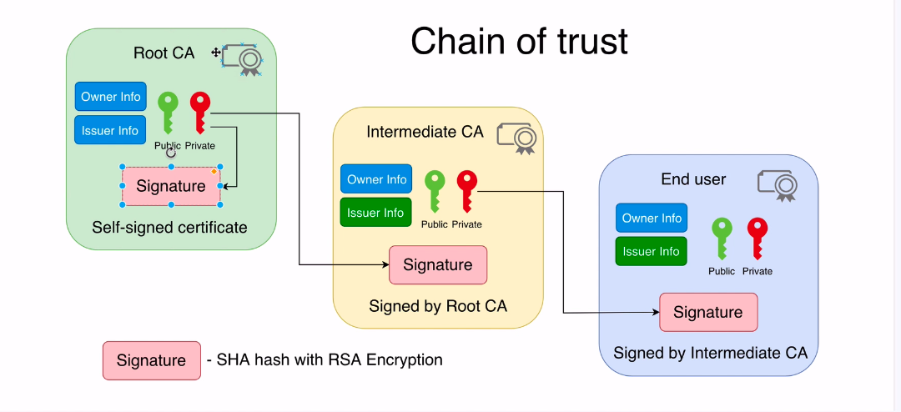
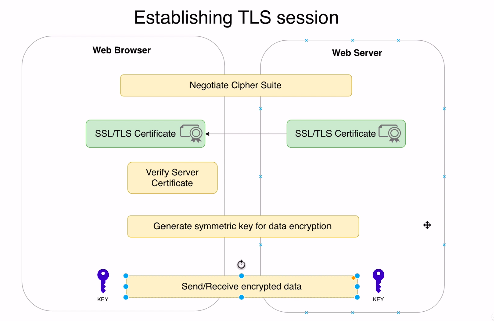

### openssl genarate key

openssl genrsa -aes256 -out private.pem

openssl rsa -in private.pem -outform PEM -pubout -out public.pem

### Certificate

* Each Operating system ships with the list of the pre-installed certificates of Root CAs(does not include intermediat CA)




### Process of establishing TLS session



### How to configure syslogng with SSL   
* send syslogng sender to syslogng receiver     
[https://www.techbeatly.com/2019/08/configure-tls-encrypted-tunnel-for-remote-logs-using-syslog-ng.html#.X3aCZ3X0k5k](https://www.techbeatly.com/2019/08/configure-tls-encrypted-tunnel-for-remote-logs-using-syslog-ng.html#.X3aCZ3X0k5k)     

[https://www.youtube.com/watch?v=DrfBU9nBeoE&list=PLtL8QEcfcsiYsy0Qs3VcZyFv2FezBaAyx&index=39&t=1101s](https://www.youtube.com/watch?v=DrfBU9nBeoE&list=PLtL8QEcfcsiYsy0Qs3VcZyFv2FezBaAyx&index=39&t=1101s)

[https://www.youtube.com/watch?v=YAYfBteY0kg&list=PLtL8QEcfcsiYsy0Qs3VcZyFv2FezBaAyx&index=51&t=737s](https://www.youtube.com/watch?v=YAYfBteY0kg&list=PLtL8QEcfcsiYsy0Qs3VcZyFv2FezBaAyx&index=51&t=737s)


### Understand SSL 

[https://dev.to/techschoolguru/a-complete-overview-of-ssl-tls-and-its-cryptographic-system-36pd](https://dev.to/techschoolguru/a-complete-overview-of-ssl-tls-and-its-cryptographic-system-36pd)


[https://www.youtube.com/watch?v=wzbf9ldvBjM](https://www.youtube.com/watch?v=wzbf9ldvBjM)


### check if ssl is enabled

```
openssl s_client -connect 54.161.237.103:6514
```
