# Examples

* DropWizard elasticsearch app: 
[https://github.com/RyanGao67/ElasticSearch_Java](https://github.com/RyanGao67/ElasticSearch_Java)

* Elasticsearch highlevel client: 
[https://github.com/RyanGao67/elasticsearch_java_1/blob/master/src/main/java/com/example.java](https://github.com/RyanGao67/elasticsearch_java_1/blob/master/src/main/java/com/example.java)

* [https://github.com/RyanGao67/elasticsearch_java_2/blob/master/src/main/java/com/shallowlightning/App.java](https://github.com/RyanGao67/elasticsearch_java_2/blob/master/src/main/java/com/shallowlightning/App.java)

* How to run multinode elasticsearch  
 [https://www.elastic.co/guide/en/elasticsearch/reference/current/docker.html](https://www.elastic.co/guide/en/elasticsearch/reference/current/docker.html)


*  [https://github.com/RyanGao67/elasticsearch3/blob/master/src/main/java/com/shallowlightning/App.java](https://github.com/RyanGao67/elasticsearch3/blob/master/src/main/java/com/shallowlightning/App.java)

# Elasticsearch CMD

```
//Start a elasticsearch: 
sudo docker run -d --name es762 -p 9200:9200 -e "discovery.type=single-node" elasticsearch:7.6.2

//check elasticsearch information
curl localhost:9200
{
  "name" : "5f3477e4bef8",
  "cluster_name" : "docker-cluster",
  "cluster_uuid" : "fcz4zPNZSSGl3Ti2_Z-iqw",
  "version" : {
    "number" : "7.6.2",
    "build_flavor" : "default",
    "build_type" : "docker",
    "build_hash" : "ef48eb35cf30adf4db14086e8aabd07ef6fb113f",
    "build_date" : "2020-03-26T06:34:37.794943Z",
    "build_snapshot" : false,
    "lucene_version" : "8.4.0",
    "minimum_wire_compatibility_version" : "6.8.0",
    "minimum_index_compatibility_version" : "6.0.0-beta1"
  },
  "tagline" : "You Know, for Search"
}

// check cluster health
curl -X GET localhost:9200/_cluster/health?pretty
{
  "cluster_name" : "docker-cluster",
  "status" : "green",
  "timed_out" : false,
  "number_of_nodes" : 1,
  "number_of_data_nodes" : 1,
  "active_primary_shards" : 0,
  "active_shards" : 0,
  "relocating_shards" : 0,
  "initializing_shards" : 0,
  "unassigned_shards" : 0,
  "delayed_unassigned_shards" : 0,
  "number_of_pending_tasks" : 0,
  "number_of_in_flight_fetch" : 0,
  "task_max_waiting_in_queue_millis" : 0,
  "active_shards_percent_as_number" : 100.0
}

// check elasticsearch node, ?v will print the header
curl -X GET localhost:9200/_cat/nodes?v
ip         heap.percent ram.percent cpu load_1m load_5m load_15m node.role master name
172.17.0.2           16          90  50    3.15    3.02     2.02 dilm      *      5f3477e4bef8

// check the indices
curl -X GET localhost:9200/_cat/indices?v
health status index uuid pri rep docs.count docs.deleted store.size pri.store.size

// search full version
curl -XGET -u username:password "https://adsfadfadf:9300/.kibana/_search" \
-H 'Content-Type: application/json' \
-d '{"query":{"match_all":{}}}'
```

# Sharding
* A shard is an independent index(kind of)
* Each shard is an Apache Lucene index
* An elasticsearch index consists of one or more Lucene indices
* A shard has no predefined size; it grows as documents are added to it
* A shard may store up to about two billion documents


# The purpose of Sharding
* Mainly to be able to store more documents
* To easier fit large indices onto nodes
* Improved performance
  * Parallelization of queries increases the throughput of an index
  
```
// check the indices
curl -X GET localhost:9200/_cat/indices?v
health status index uuid pri rep docs.count docs.deleted store.size pri.store.size
```

The pri is primary shards, think of this column as the number of shards that a given index has. For example, each of our indices are stored on a single shard, being the default setting. 

Up until Elasticsearch version 7, the default was actually for an index to have five shards.However, having five shards for very small indices is very unnecessary.When people created lots of small indices within small clusters, they ran into an issue of over-sharding, meaning that they had way too many shards. At the same time, it was previously not possible to change the number of shards once an index had been created.

So what you had to do if you needed to increase the number of shards, was to create a new index with more shards, and move over the documents. This was not only inconvenient, but could also be a time consuming process. To overcome these challenges, indices are created with a single shard by default, since Elasticsearch version 7. For small to medium sized indices, this is likely to be sufficient. If you do need to increase the number of shards, there is a Split API for this. It still involves creating a new index, but the process is much easier, as Elasticsearch handles the heavy lifting for us. To go the other way, i.e. to reduce the number of shards, there is a Shrink API that does this for us.


However, as a rule of thumb, a decent place to start, would be to choose five shards if you anticipate millions of documents to be added to an index. Otherwise, you should be completely fine sticking to the default of one shard and then increase the number if need be.

To recap, sharding is a way to sub-divide an index into smaller pieces, each being a shard. This serves two main purposes; enabling the index to grow in size, and to improve the throughput of the index.

By using sharding, you can store an index taking up 700 gigabytes of disk space, even if you have no single node that can store that amount of data. An index defaults to having one shard.

# Replication
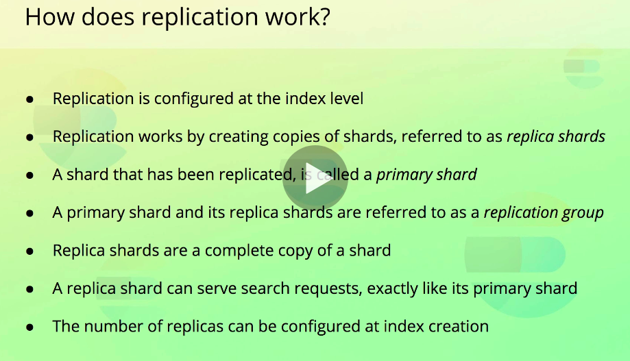

# Increase query throughput with replication
We don't really need another node, and we also don't want to increase our costs.Instead, we can increase the number of replica shards by one, or however many we need. Since we only have two nodes, we are not really increasing the availability of the index, but we are increasing the throughput of the index.

A replica shard is a fully functional index on its own, just like a shard is. This actually means that both of the replica shards can be queried at the same time. This is possible because of two things; the fact that Elasticsearch automatically coordinates where queries will be executed, and parallelization.Elasticsearch will automatically select the shard that will execute a given query, based on a number of factors


```
// see shards situation
cat /_cat/shards?v

example return: 
index shard prirep state    docs store ip        node
pages 0     p/r    STARTED  0    230b  127.0.0.1 Bos-MBP-2
```


# Roles

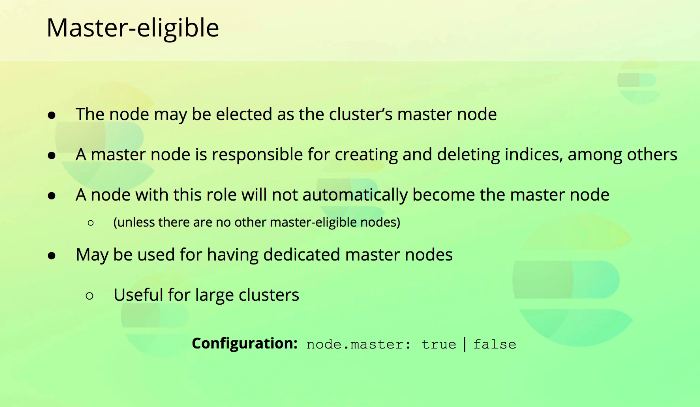

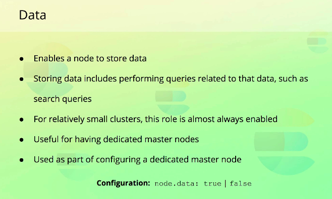

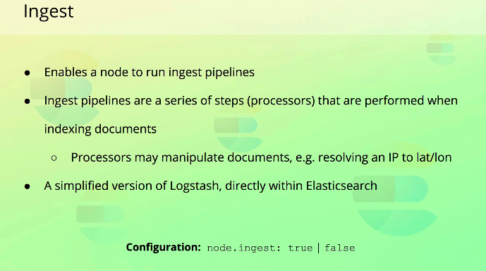 

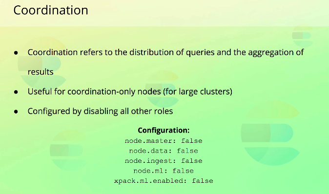


```
// check elasticsearch node, ?v will print the header
curl -X GET localhost:9200/_cat/nodes?v
ip         heap.percent ram.percent cpu load_1m load_5m load_15m node.role master name
172.17.0.2           16          90  50    3.15    3.02     2.02 dilm      *      5f3477e4bef8

```

node.role here is dim, data inject master


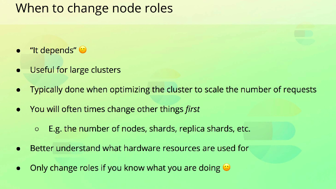

```
ryangao67@ryangao67-ThinkPad-T460s:~/tgao2020/ComputerScience$ curl -X POST localhost:9200/products/_doc/100 -H 'Content-Type:application/json' -d '{"name":"Toaster", "price":49, "in_stock":true}'
{"_index":"products","_type":"_doc","_id":"100","_version":1,"result":"created","_shards":{"total":3,"successful":1,"failed":0},"_seq_no":1,"_primary_term":1}

ryangao67@ryangao67-ThinkPad-T460s:~/tgao2020/ComputerScience$ curl -X POST localhost:9200/products/_search
{"took":184,"timed_out":false,"_shards":{"total":2,"successful":2,"skipped":0,"failed":0},"hits":{"total":{"value":2,"relation":"eq"},"max_score":1.0,"hits":[{"_index":"products","_type":"_doc","_id":"T_OHJXYBjcvHWAUM583g","_score":1.0,"_source":{"name": "Coffee Maker"}},{"_index":"products","_type":"_doc","_id":"100","_score":1.0,"_source":{"name":"Toaster", "price":49, "in_stock":true}}]}}

ryangao67@ryangao67-ThinkPad-T460s:~/tgao2020/ComputerScience$ curl -X POST localhost:9200/products/_search?pretty
{
  "took" : 6,
  "timed_out" : false,
  "_shards" : {
    "total" : 2,
    "successful" : 2,
    "skipped" : 0,
    "failed" : 0
  },
  "hits" : {
    "total" : {
      "value" : 2,
      "relation" : "eq"
    },
    "max_score" : 1.0,
    "hits" : [
      {
        "_index" : "products",
        "_type" : "_doc",
        "_id" : "T_OHJXYBjcvHWAUM583g",
        "_score" : 1.0,
        "_source" : {
          "name" : "Coffee Maker"
        }
      },
      {
        "_index" : "products",
        "_type" : "_doc",
        "_id" : "100",
        "_score" : 1.0,
        "_source" : {
          "name" : "Toaster",
          "price" : 49,
          "in_stock" : true
        }
      }
    ]
  }
}
```

# Create index
```
curl -XPUT localhost:9200/products -H 'Content-Type: application/json' -d '{"settings":{"number_of_shards":2, "number_of_replicas":2}}' 


curl -XDELETE localhost:9200/products
{"acknowledged":true}


curl -H 'Content-Type: application/json' -X PUT localhost:9200/risk_scores -d \
'{ 

"settings": { 
	"number_of_shards": "2", 
 	"number_of_replicas": "1" 
}, 

"mappings" : { 
	"properties" : { 
		"entityName" : { 
			"type" : "text", 
			"fields" : {                          // the raw here is name specified by us
				"raw" : {"type" : "keyword"}
			} 
		}, 
		"entityType" : { 
			"type" : "text", 
			"fields" : {"raw" : {"type" : "keyword"}} 
		},
		"entityHash" : {
			"type" : "keyword"
		},
		"hasAnomalies" : {
			"type" : "boolean"
		}, 
		"id" : {
			"type" : "keyword"
		}, 
		"score" : {
			"type" : "double"
		}, 
		"timestamp" : {
			"type" : "date"
		}
	} 
}

}'
```

# Update
```
curl -X POST localhost:9200/products/_update/100 -H "Content-Type:application/json" -d '{"doc":{"tags":["electronics"]}}'
{"_index":"products","_type":"_doc","_id":"100","_version":2,"result":"updated","_shards":{"total":2,"successful":1,"failed":0},"_seq_no":1,"_primary_term":1}

curl -X POST localhost:9200/products/_update/100 -H "search?pretty
{
  "took" : 12,
  "timed_out" : false,
  "_shards" : {
    "total" : 1,
    "successful" : 1,
    "skipped" : 0,
    "failed" : 0
  },
  "hits" : {
    "total" : {
      "value" : 1,
      "relation" : "eq"
    },
    "max_score" : 1.0,
    "hits" : [
      {
        "_index" : "products",
        "_type" : "_doc",
        "_id" : "100",
        "_score" : 1.0,
        "_source" : {
          "name" : "Toaster",
          "price" : 49,
          "in_stock" : true,
          "tags" : [
            "electronics"
          ]
        }
      }
    ]
  }
}

```

The Update API: 
1. The current document is retrieved
2. The field values are changed
3. The existing document is replaced with the modified document
4. We could do the exact same thing at the application level

*Because document is immutable*

# Script
```
curl -X POST -H "Content-Type:application/json" localhost:9200/products/_update/100 \
-d '{"script":{"source":"ctx._source.price--"}}'
{"_index":"products","_type":"_doc","_id":"100","_version":3,"result":"updated","_shards":{"total":2,"successful":1,"failed":0},"_seq_no":2,"_primary_term":1}

curl -X POST -H "Content-Type:application/json" localhost:9200/products/_search?pretty
{
  "took" : 6,
  "timed_out" : false,
  "_shards" : {
    "total" : 1,
    "successful" : 1,
    "skipped" : 0,
    "failed" : 0
  },
  "hits" : {
    "total" : {
      "value" : 1,
      "relation" : "eq"
    },
    "max_score" : 1.0,
    "hits" : [
      {
        "_index" : "products",
        "_type" : "_doc",
        "_id" : "100",
        "_score" : 1.0,
        "_source" : {
          "name" : "Toaster",
          "price" : 48,
          "in_stock" : true,
          "tags" : [
            "electronics"
          ]
        }
      }
    ]
  }
}

curl -X POST -H "Content-Type:application/json" localhost:9200/products/_update/100 -d \
'{
  "script":
    {"source":"ctx._source.price-=params.quantity",
     "params":{"quantity":4}
 }
}'
{"_index":"products","_type":"_doc","_id":"100","_version":4,"result":"updated","_shards":{"total":2,"successful":1,"failed":0},"_seq_no":3,"_primary_term":1}

curl -X POST -H "Consearch?pretty
{
  "took" : 1,
  "timed_out" : false,
  "_shards" : {
    "total" : 1,
    "successful" : 1,
    "skipped" : 0,
    "failed" : 0
  },
  "hits" : {
    "total" : {
      "value" : 1,
      "relation" : "eq"
    },
    "max_score" : 1.0,
    "hits" : [
      {
        "_index" : "products",
        "_type" : "_doc",
        "_id" : "100",
        "_score" : 1.0,
        "_source" : {
          "name" : "Toaster",
          "price" : 44,
          "in_stock" : true,
          "tags" : [
            "electronics"
          ]
        }
      }
    ]
  }
}
```


Two other possible values for the "result"(see above update command)key that is specified within the query results, apart from "updated." The key may also contain the value "noop." In the previous lecture, I told you that this is the case if we try to update a field value with its existing value. The same is not the case with scripted updates; if we set a field value within a script, the result will always equal "updated," even if no field values actually changed. There are two exceptions to this, both being if we explicitly set the operation within the script.

For example, we can write a script that ignores a given document based on a condition. This is done by setting the "op" property on the "ctx" variable to "noop."

Note that you can write a similar script that just inverts the conditional statement and only reduces the field value if it evaluates to "true." The difference between these two scripts, is that the one to the right always yields a result of "updated," regardless of whether or not the field value was actually changed. This is not the case for the one on the left. So if it's important for you to detect if nothing was changed, then that's the way to go.

Actually, you can also set the operation to "delete," which will cause the document to be deleted instead. This will set the value of the "result" key to "deleted" within the results. This is rarely useful though, as you can also delete documents that match a given query, as you will see later in this section, so this should only be used for situations where you need to use scripting to determine if a document should be deleted. You can see an example of such a query on your screen. The query decreases the value of the "in_stock" field by one as long as it is less than or equal to one.

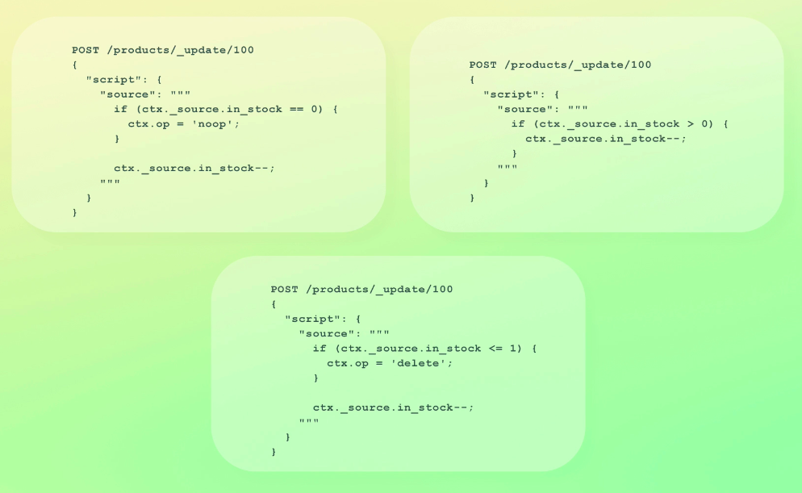


# Upsert
```
curl -XPOST localhost:9200/products/_update/101 -H "Content-Type:application/json" -d '{"script":{"source":"ctx._source.price++"},"upsert":{"name":"Blender", "price":399, "in_stock":true}}'
{"_index":"products","_type":"_doc","_id":"101","_version":1,"result":"created","_shards":{"total":2,"successful":1,"failed":0},"_seq_no":5,"_primary_term":1}
```

If id 101 exists, it will update using the script, otherwise it will create. 


# Replace

It is the same as index 

```
PUT /products/_doc/100
{
  "name":"Toaster",
  "price":79,
  "in_stock":4
}
```

# Delete
```
DELETE /products/_doc/101
```

# Routing
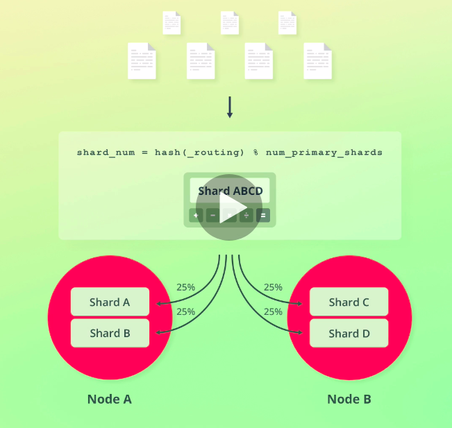

# Reading
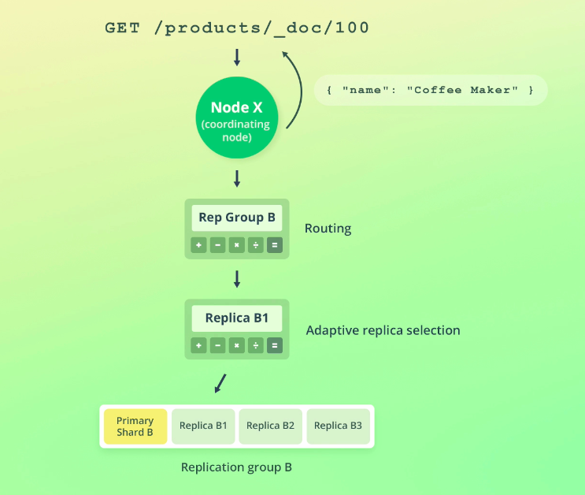

# Writing
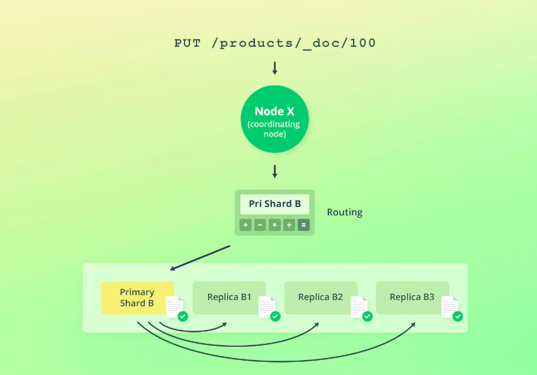

how it works inside
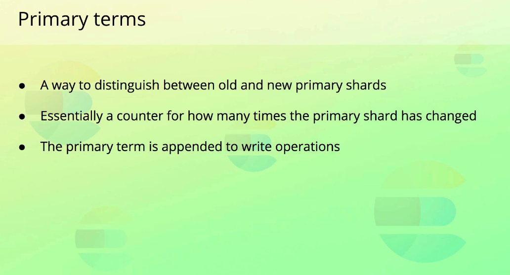
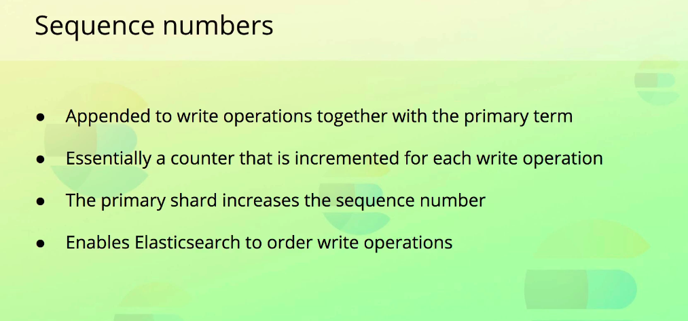
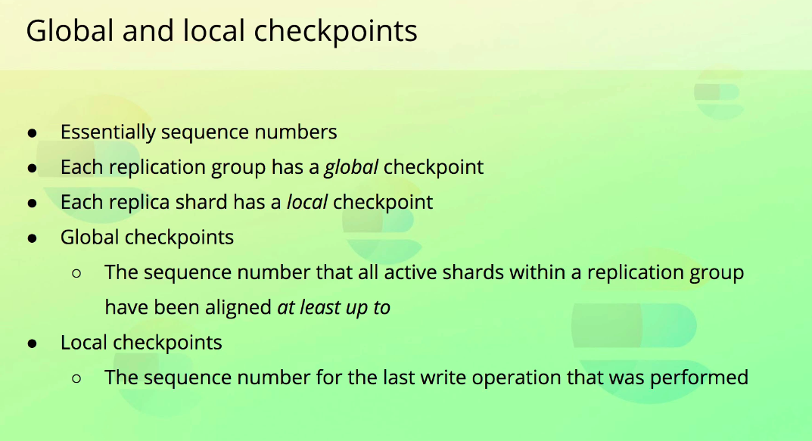


# primary_term and seq_no 
This is to solve the concurrency issue(Optimistic concurrency control)
```

ryangao67@ryangao67-ThinkPad-T460s:~$ curl -XGET localhost:9200/products/_doc/100?pretty
{
  "_index" : "products",
  "_type" : "_doc",
  "_id" : "100",
  "_version" : 6,
  "_seq_no" : 6,
  "_primary_term" : 1,
  "found" : true,
  "_source" : {
    "name" : "Toaster",
    "price" : 36,
    "in_stock" : true,
    "tags" : [
      "electronics"
    ]
  }
}
ryangao67@ryangao67-ThinkPad-T460s:~$ curl -X POST -H "Content-Type:application/json" localhost:9200/products/_update/100?if_primary_term=151186&if_seq_no=6 -d '{"doc":{"in_stock":false}}'
```

If the primary_term and seq_no do not match then there is some thing wrong, eg, another thread makes changes and hasn't been synced. 

# _update_by_query

```
POST /products/_update_by_query
{
	"script":{
		"source":"ctx._source.in_stock--"
	},
 	"query":{
		"match_all":{}	
	}
}
```

**behind the scene**

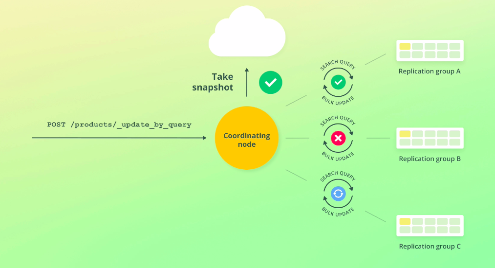
The first thing that happens when an Update By Query request is processed, is that a snapshot of the index is created. I will get back to why this is the case in a moment. When the snapshot has been taken, a search query is sent to each of the index' shards, in order to find all of the documents that match the supplied query. Whenever a search query matches any documents, a bulk request is sent to update those documents. We haven't covered bulk requests yet, but it's a way to perform document actions on many documents with one request. Specifically, the index, update, and delete actions. Anyway, we'll get to that soon. The "batches" key within the results, specifies how many batches were
used to retrieve the documents. The query uses something called the Scroll API internally, which is a way to scroll through result sets. The point of this is to be able to handle queries that may match thousands of documents. Each pair of search and bulk requests are sent sequentially, i.e. one at a time. The reason for not doing everything simultaneously, is related to how errors are handled. Should there be an error performing either the search query or the bulk query, Elasticsearch will automatically retry up to ten times. The number of retries is specified within the "retries" key, for both the search and bulk queries. If the affected query is still not successful, the whole query is aborted. The failures will then be specified in the results, within the "failures" key. It is important to note that the query is aborted, and not rolled back. This means that if a number of documents have been updated when an error occurs, those documents will remain updated, even though the request failed. The query is therefore not run within a transaction as you might be familiar with from various databases. That is actually not something unique to this API, but rather a general design pattern.

Typically you will see that if an API can partially succeed or fail, it will return information that you can use to deal with it. The diagram that you see now, shows that the queries were run successfully against Replication Group A, but something went wrong while sending queries to Replication Group B, causing the query to be aborted. Any documents that may match the search query, are therefore not updated within Replication Group C. The documents that were updated within Replication Group A, will remain updated even though the query was aborted. The reason why Elasticsearch takes a snapshot of the index, is to ensure that the updates are performed on the basis of the current state of the index. For an index where documents are indexed, modified, and deleted frequently, it is not unlikely that something has changed from when Elasticsearch received the query, to when it finishes processing it. This is especially true when updating many documents. When Elasticsearch is requested to update a given document, it uses the document's primary term and sequence number from the snapshot to ensure that it has not been changed since creating the snapshot. If the document has been changed, there will be a version conflict, causing the document to not be updated. This will also cause the entire query to be aborted. The number of conflicts is returned under the "version_conflicts" key within the query results. If you don't want the query to be aborted when there is a version conflict, you can specify a "conflicts" key with a value of "proceed" within the request body. Note that you can also add this as a query parameter if you prefer.

```
POST /products/_update_by_query
{
	"conflicts":"proceed",
        "script":{
		"source": "ctx._source.in_stock--"	
 	},
	"query":{
		"match_all":{}
	}
}
```

What this does, is that the version conflicts will just be counted, rather than causing the query to be aborted.


# delete_by_query

```
POST /products/_delete_by_query
{
	"query":{
		"match_all":{}
	}
}
```

# Bulk
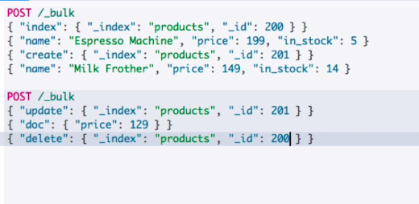
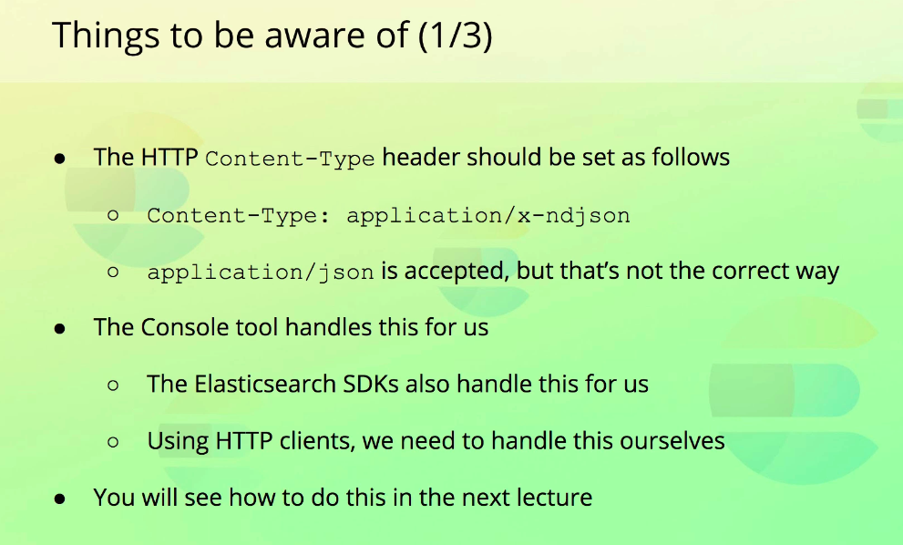

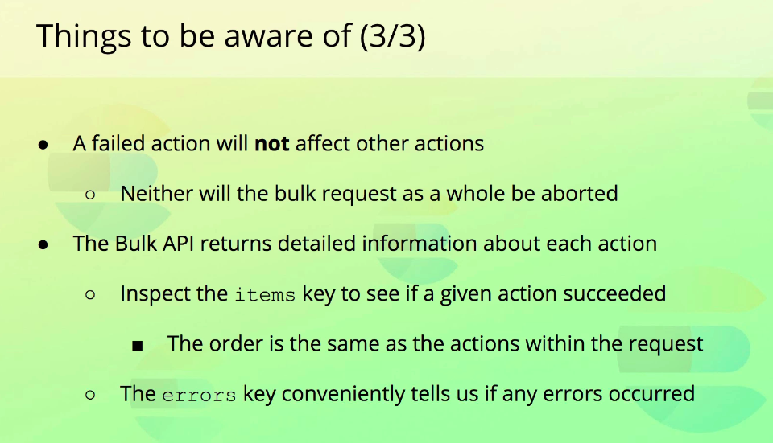
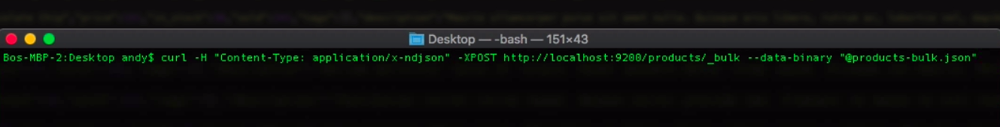


# Analyzer

```
curl localhost:9200/_analyze?pretty -H "Content-Type:application/json" -d '{"text": "2 guys walk into    a bar, the thrid... DUCKS! :-)", "analyzer": "standard"}'

{
  "tokens" : [
    {
      "token" : "2",
      "start_offset" : 0,
      "end_offset" : 1,
      "type" : "<NUM>",
      "position" : 0
    },
    {
      "token" : "guys",
      "start_offset" : 2,
      "end_offset" : 6,
      "type" : "<ALPHANUM>",
      "position" : 1
    },
    {
      "token" : "walk",
      "start_offset" : 7,
      "end_offset" : 11,
      "type" : "<ALPHANUM>",
      "position" : 2
    },
    {
      "token" : "into",
      "start_offset" : 12,
      "end_offset" : 16,
      "type" : "<ALPHANUM>",
      "position" : 3
    },
    {
      "token" : "a",
      "start_offset" : 20,
      "end_offset" : 21,
      "type" : "<ALPHANUM>",
      "position" : 4
    },
    {
      "token" : "bar",
      "start_offset" : 22,
      "end_offset" : 25,
      "type" : "<ALPHANUM>",
      "position" : 5
    },
    {
      "token" : "the",
      "start_offset" : 27,
      "end_offset" : 30,
      "type" : "<ALPHANUM>",
      "position" : 6
    },
    {
      "token" : "thrid",
      "start_offset" : 31,
      "end_offset" : 36,
      "type" : "<ALPHANUM>",
      "position" : 7
    },
    {
      "token" : "ducks",
      "start_offset" : 40,
      "end_offset" : 45,
      "type" : "<ALPHANUM>",
      "position" : 8
    }
  ]
}


# standard analyzer is same as the following

POST /_analyze
{
	"text":"2 guys walk into a bar, but the third...DUCKS! :-)",
	"char_filter":[],
 	"tokenizer":"standard",
	"filter":["lowercase"]
}

```

tokens are terms, and terms are put into inverted index which is a data structure
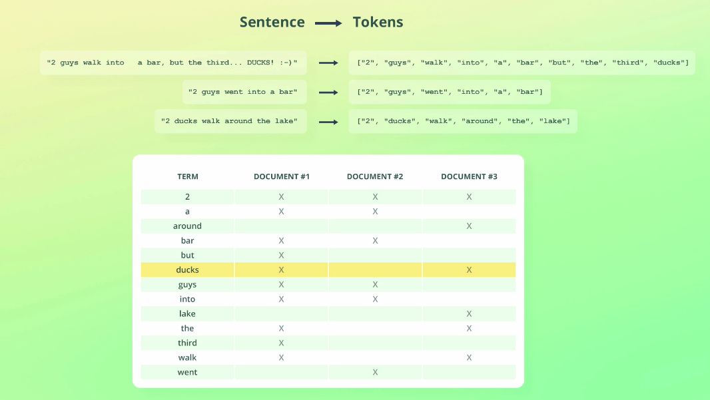
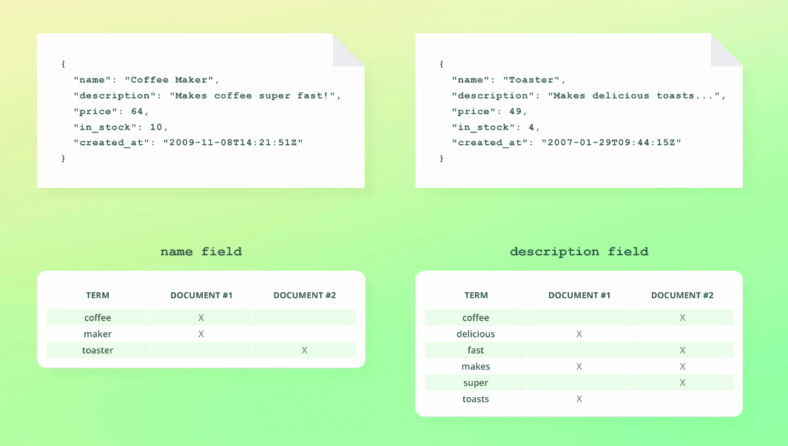


# Datatypes
1. Object
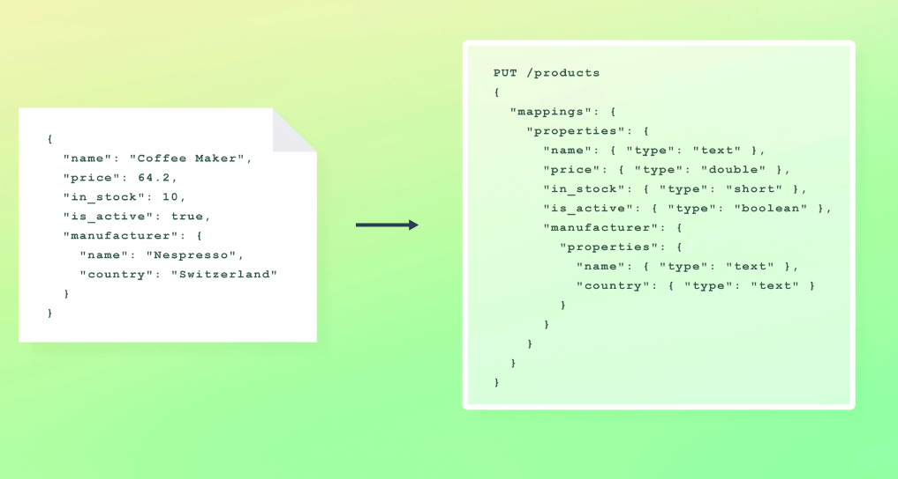
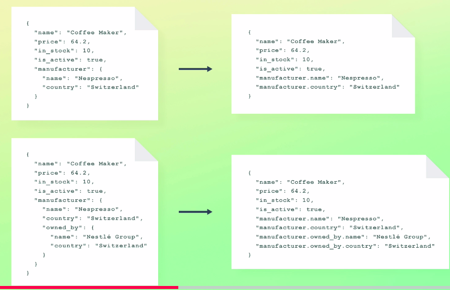
* How array of object is stored, eg:
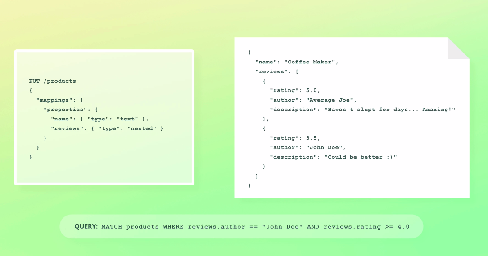

# Nested 
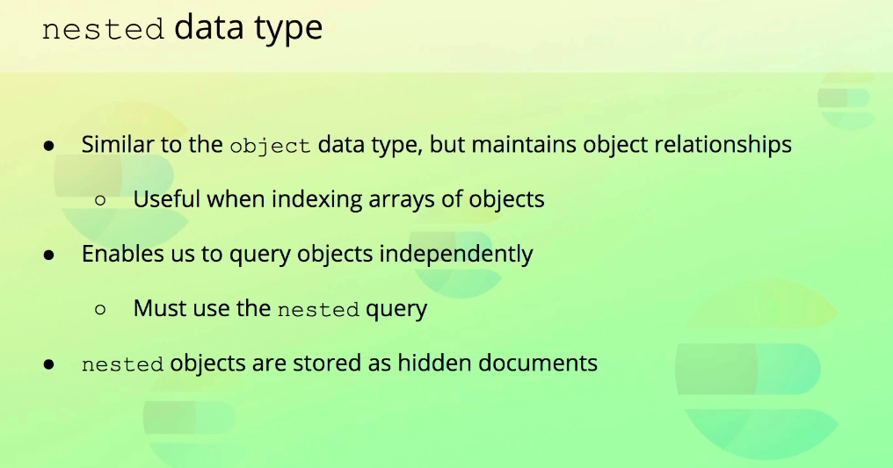

# Keyword

Keyword using noop analyzer, no operation is applied and the string is stored as it is. 

# Mapping  
```

curl -H 'Content-Type: application/json' -X PUT localhost:9200/risk_scores -d \
'{ 
"settings": 
	{ "number_of_shards": "2", "number_of_replicas": "1" }, 
"mappings" : { 
	"properties" : { 
		"entityName" : { 
			"type" : "text", 
			"fields" : {"raw" : {"type" : "keyword"}} 
		}, 
		"entityType" : { 
			"type" : "text", 
			"fields" : {"raw" : {"type" : "keyword"}} 
		}, 
		"entityHash" : {
			"type" : "keyword"
		},
		"hasAnomalies" : {
			"type" : "boolean"
		}, 
		"id" : {
			"type" : "keyword"
		}, 
		"score" : {
			"type" : "double"
		}, 
		"timestamp" : {
			"type" : "date"
		}
	} 
}
}'

```


```
curl -H 'Content-Type:application/json' -XPUT localhost:9200/reviews -d \
`
{
"mappings":{
	"properties":{
		"rating":{"type":"float"},
		"content":{"type":"text"},
		"product_id":{"type":"integer"},
		"author":{
			"properties":{
				"first_name":{"type":"text"},
				"last_name":{"type":"text"},
				"email":{"type":"keyword"}
			}
		}
	}
}
}

`

PUT /reviews/_doc/1
{
	"rating":5.0
	"content":"Outstanding course! Bo really taught me a lot about Elasticsearch!",
	"product_id":123,
	"author":{
		"first_name":"john",
		"last_name":"Doe",
		"email":"johndoe123@example.com"
	}
}

# show mapping
GET /reviews/_mapping
GET /reviews/_mapping/field/content
GET /reviews/_mapping/field/author.email

```
```
# modify the mapping
PUT /reviews/_mapping
{
	"properties":{
		"create_at":{
			"type":"date"
		}
	}
}
```

# Date

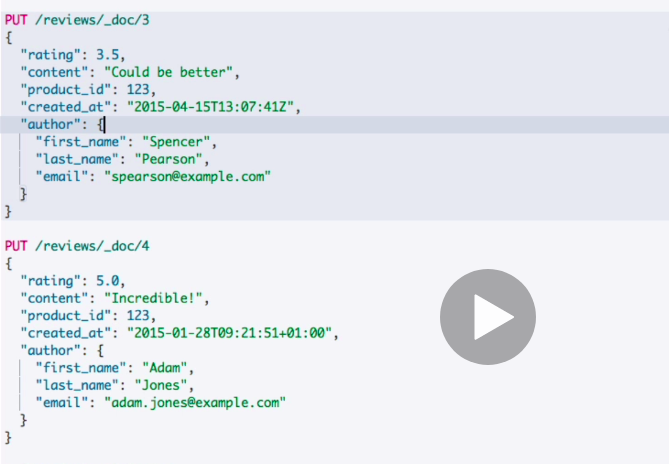


# Mapping parameters
1. format
* Used to customize the format for date fields
* I recommend using the default format whenever possible
  * "strick_date_optional_time || epoch_millis "
* Using Java's DateFormatter syntax
  * "dd/MM/yyyy" 
* Using built-in formats
  * "epoch_second"

```
PUT /sales
{
	"mappings":{
		"properties":{
			"purchased_at":{
				"type":"date",
				"format":"dd/MM/yyyy"
			}
		}
	}
}


PUT /sales
{
	"mappings":{
		"properties":{
			"purchased_at":{
				"type":"date",
				"format":"epoch_second"
			}
		}
	}
}
```

2. properties parameter
```
PUT /sales
{
	"mappings":{
		"properties":{
			"sold_by":{
				"properties":{
					"name":{"type":"text"}
				}
			}
		}
	}
}

PUT /sales
{
	"mappings":{
		"properties":{
			"products":{
				"type":"nested",
				"properties":{
					"name":{"type":"text"}
				}
			}
		}
	}
}
```

3. coerce parameter
```
PUT /sales
{
	"mappings":{
		"properties":{
			"amount":{
				"type":"float",
				"coerce":false
			}
		}	
	}
}


PUT /sales
{
	"setting":{"index.mapping.coerce":false},
	"mappings":{
		"properties":{
			"amount":{
				"type":"float",
				"coerce":true
			}
		}
	}
}
```

4. doc_values

Essentially an uninverted index    
Used for sorting, aggregations, and scripting    
An additional data structure, not a replacement   
Elasticsearch automatically queries the appropriate data structure   

Disabling doc_values
* Set the doc_values parameter to false to save disk space
  * Also slightly increases the indexing throughput
* Only disable doc values if you won't use aggregations, sorting, or scripting  
* Particularly useful for large indices; typically not worth it for small ones
* Cannot be changed without reindexing documents into new index
  * Use with caution, and try to anticipate how fields will be queried

```
PUT /sales
{
	"mappings":{
		"properties":{
			"buyer_email":{
				"type":"keyword",
				"doc_values":false
			}
		}
	}
}
```

5. norms

* Normalization factors used for relevance scoring  
* Often we don't just want to filter results, but also rank them   
* Norms can be disabled to save disk space  
  * Useful for fields that won't be used for relevance scoring
  * the fields can still be used for filtering and aggregations

```
PUT /products
{
	"mappings":{
		"properties":{
			"tags":{
				"type":"text",
				"norms":false
			}
		}
	}
}
```

6. index

* Disables indexing for a field
* Values are still stored within _source
* Useful if you won't use a field for search queries  
* Saves disk space and slightly improves indexing throughput  
* often used for time series data
* Fields with indexing disabled can still be used for aggregations

```
PUT /server-metrics
{
	"mappings":{
		"properties":{
			"server_id":{
				"type":"integer",
				"index":false
			}
		}
	}
}
```

# Updating field mapping

Mostly you cannot updating existing mapping (eg, changing the data types)


# reindexing

```
POST /_reindex
{
	"source":{
		"index":"reviews"
	},
	"dest":{
		"index":"reviews_new"
	},
	"script":{
		"source":"""
			if(ctx._source.product_id!=null){
				ctx._source.product_id = ctx._source.product_id.toString();
			}
		"""
	}
}

POST /_reindex
{
	"source":{
		"index":"review",
		"query":{
			"range":{
				"rating":{
					"gte":4.0
				}
			}
		}
	},
	"dest":{
		"index":"reviews_new"
	}
}


```

# DELETE by query
```
POST /reviews_new/_delete_by_query
{
	"query":{
		"match_all":{}
	}
}
```


# Multi-field mappings
Eg, we cannot run aggregations on text fields, (aggregation can be run on dates and numbers)

```
curl -H 'Content-Type: application/json' -X PUT localhost:9200/risk_scores -d \
'{

"settings": {
        "number_of_shards": "2",
        "number_of_replicas": "1"
},

"mappings" : {
        "properties" : {
                "entityName" : {
                        "type" : "text",
                        "fields" : {                          // the raw her
e is name specified by us
                                "raw" : {"type" : "keyword"}
                        }
                },
                "entityType" : {
                        "type" : "text",
                        "fields" : {"raw" : {"type" : "keyword"}}
                },
                "entityHash" : {
                        "type" : "keyword"
                },
                "hasAnomalies" : {
                        "type" : "boolean"
                },
                "id" : {
                        "type" : "keyword"
                },
                "score" : {
                        "type" : "double"
                },
                "timestamp" : {
                        "type" : "date"
                }
        }
}

}'


```

# Index template
```
PUT /_template/access-logs
{
	"index_patterns":["access-logs-*"],
	"settings":{"numer_of_shards":2, "index.mapping.coerce":false},
	"mappings":{
		"properties":{
			....
		}
	}
}

```

# Mapping recommendations
* Set doc_values to false if you don't need soring, aggregations, and scripting

* Set norms to false if you don't need relevence scoring

* Set index to false if you don't need to filter on values

  * You can still do aggregations, eg, for time series data

* Probably only worth the effort when storing lots of documents 

  * otherwise it's probably an over complication

* Worst case scenario, you will need to reindex documents


# Analyzer
1. Standard analyzer:  
*  Splits text at word boundaries and removes punctuation
  * Done by the standard tokenizer
* Lowercases letters with the lowercase token filter
* Contains the stop token filter (disable by default)

2. simple analyzer
* Similar to the standard analyzer
  * Split into tokens when encountering anything else than letters
* Lowercases letters with the lowercase tokenizer
  * Unusual and a performance hack

3. whitespace analyzer
* split text into tokens by whitespace
* Does not lowercase letters

4. keyword analyzer
* No-op analyzer that leaves the input text intact
  * it simply outputs it as a single token
* Used for keyword fields by default
  * Used for exact matching

5. pattern analyzer
* A regular expression is used to match token separators
  * it should match whatever should split the text into tokens
* This analyzer is very flexible  
* The default pattern matches all non-word characters(/W+)
* Lowercases letters by default

An example analyzer

```
// example 1: modify existing analyzer
PUT /products
{
	"settings":{
		"analysis":{
			"analyzer":{
				"remove_english_stop_words":{
					"type": "standard",
					"stopwords": "_english_"
				}
			}
		}
	}
}

// example 3: 
PUT /analyzer_test
{
	"settings":{
		"analysis":{
			"analyzer":{
				"my_custom_analyzer":{
					"type":"custom",
					"char_filter":["html_strip"],
					"tokenizer":"standard",
					"filter":[
						"lowercase",
						"stop",
						"asciifolding"
					]
				}
			}
		}
	}
}

// to test example 3:
POST /analyzer_test/_analyze
{
	"analyzer":"my_custom_analyzer",
	"text":"I&apos;m a <em>good</em> mood&nbsp;-&nbsp;and I <strong>love</strong> acai!"
}

// example 2: create a new analyzer
PUT /english_example
{
  "settings": {
    "analysis": {
      "filter": {
        "english_stop": {
          "type":       "stop",
          "stopwords":  "_english_" 
        },
        "english_keywords": {
          "type":       "keyword_marker",
          "keywords":   ["example"] 
        },
        "english_stemmer": {
          "type":       "stemmer",
          "language":   "english"
        },
        "english_possessive_stemmer": {
          "type":       "stemmer",
          "language":   "possessive_english"
        }
      },
      "char_filter":{},
      "tokenizer":{},
      "analyzer": {
        "rebuilt_english": {
          "tokenizer":  "standard",
          "filter": [
            "english_possessive_stemmer",
            "lowercase",
            "english_stop",
            "english_keywords",
            "english_stemmer"
          ]
        }
      }
    }
  }
}

// How to use analyzer

PUT /products
{
	"mappings":{
		"properties":{
			"description":{
				"type":"text",
				"analyzer":"english"
			}
		}
	}
}

POST /products/_doc
{
	"description":"Is that Perter's cute-looking dog?"
}


// ==========> ["peter", "cute", "look", "dog"]


```
# Aggregation

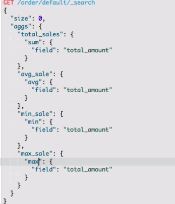

# Example multiple subaggregation with sort
```
curl -XPOST localhost:9200/risk_scores/_search\?pretty -H "Content-Type:application/json" -d \
'{
    "size":0,
    "aggs":{
        "first":{
            "terms":{
                "field":"entityHash",
                "size":5,                        
                "order": {"second": "desc"}    
            },                       
            "aggs":{
                "second":{                     
                    "max":{
                        "field":"score"
                    }      

                },
                "third": {
                    "top_hits": {      
                        "_source": {
                            "includes": ["hasAnomalies","timestamp", "score", "entityHash" ]
                        },                                                   
                        "size": 5                                                           
                    }               
                }                                                                           
            }                       
        }                                                                                   
    }            
}'                               

```

# Open & closed indices

* An open index is available for indexing and search requests

* A closed index will refuse requests
  * Read and write requests are blocked
  * Necessary for performing some operations

# Dynamic and static settings

* Dynamic settings can be changed without closing the index first
  * Requires no downtime
* Static settings require the index to be closed first
  * The index will be briefly unavailable
* Analysis settings are static settings

```
//close a index
PUT /analyzer_test/_close

// adding analyzers to existing indices
PUT /analyzer_test/_settings
{
	"analysis":{
		"analyzer":{
			"my_second_analyzer":{
				"type":"custom",
				"tokenizer":"standard",
				"char_filter":["html_strip"],
				"filter":[
					"lowercase",
					"stop",
					"asciifolding"
				]
			}
		}
	}
}

// reopening index
POST /analyzer_test/_open

GET /analyzer_test/_settings
```


# How to debug a query
```
// this will show why the document match or not match query 
// GET /<index>/<type>/<id>/_explain
GET /product/default/1/_explain
{
	"query":{
		"term":{
			"name":"lobster"
		}
	}
}
```


# query context vs filter context

* query context: 

We're essentially asking how well the documents match this query,  elastic search will still decide whether or not documents match in the first place but a relevant score will also be calculated.


* filter context

query is what we have seen so far because we nested a term query Clauss within a query object.

The reason we did that is because there is another place where we can accurately assess within a filter context when adding a query clause within a filter context we ask elasticsearch wheather the documents match the query. 

That part is the same as with the query context.

But the important difference is that with the filter context no relevent score is calculated.


# term query and terms query

```
 curl -XPOST -H 'Content-Type:application/json' localhost:9200/risk_scores/_search\?pretty -d \
'{"query":
	{"term":
		{"entityHash":{"value":
				"8093bc0a5fa1d022bc8cd3765ae253f5"
			}
		}
	}
}'
``` 


```
GET /product/default/_search
{
	"query":{
		"terms":{
			"tags.keyword":[
				"Soap",
				"Cake"
			]
		}
	}
}
```
[https://www.elastic.co/guide/en/elasticsearch/reference/current/query-dsl-terms-query.html](https://www.elastic.co/guide/en/elasticsearch/reference/current/query-dsl-terms-query.html)


# id query
```
GET /product/default/_search{
	"query":{
		"ids":{
			"values":[1,2,3]
		}
	}
}
```


# Range query

```
GET /product/default/_search
{
	"query":{
		"range":{
			"created":{
				"gte":"01-01-2010",
				"lte":"31-12-2010",
				"format":"dd-MM-yyyy"
			}
		}
	}
}
```

# date math
```
GET /product/default/_search
{
	"query":{
		"range":{
			"created":{
				"gte":"2010/01/01||-1y/M"
			}
		}
	}
}
```

-1y means minus 1 year
/M means round to month

# not null
```
GET /product/default/_search
{
	"query":{
		"exists":{
			"field":"tags"
		}
	}
}
```

# prefix
```
GET /product/default/_search
{
	"query":{
		"prefix":{
			"tags.keyword":"Vege"
		}
	}
}
```

# Wildcard
```
GET /product/default/_search
{
	"query":{
		"wildcard":{
			"tags.keyword":"Veg*ble"
		}
	}
}
```

```
GET /product/default/_search
{
	"query":{
		"wildcard":{
			"tags.keyword":"Veg?ble"
		}
	}
}
```

```
  ? match only 1
  * match anything
```
avoid wildcard query. it is a for loop search

# regx

```
GET /product/default/_search
{
	"query":{
		"regexp":{
			"tags.keyword":"Veget[a-zA-Z]+ble"
		}
	}
}
```

# match query
```
GET /recipe/default/_search
{
	"query":{
		"match":{
			"title":"Recipes with pasta or spaghetti"
		}
	}
}
```

Example

```
Please write a query searching for the sentence "pasta with parmesan and spinach" within the "title" field, simulating that this sentence was entered by a user within a search field.

GET /recipe/_doc/_search
{
  "query": {
    "match": {
      "title": "Pasta with parmesan and spinach"
    }
  }
}
Please write a query searching for phrase "pasta carbonara" within the "title" field.

GET /recipe/_doc/_search
{
  "query": {
    "match_phrase": {
      "title": "pasta carbonara"
    }
  }
}
Please write a query searching for the terms "pasta" or "pesto" within the "title" and "description" fields.

GET /recipe/_doc/_search
{
  "query": {
    "multi_match": {
      "query": "pasta pesto",
      "fields": [ "title", "description" ]
    }
  }
}
```

# boolquery
```
GET /recipe/default/_search
{
	"query":{
		"bool":{
			"must":[
				{
					"match":{
						"ingredients.name":{
						"query":"parmesan",
						"_name":"parmeson_must"
						}
					}
				}
			],
			"must_not":[
				{
					"match":{
						"ingredients.name":{
						"query":"tuna",
						"_name":"tuna_must_not"
						}
					}
				}
			],
			"should":[
				{
					"match":{
						"ingredients.name":{
						"query":"parsley",
						"_name":"parsley_should"
						}
					}
				}
			],
			"filter":[
				{
					"range":{
						"preparation_time_minutes":{
						"lte":15,
						"_name":"prep_time_filter"
						}
					}
				}
			]
		}
	}
}

```

# internal match query
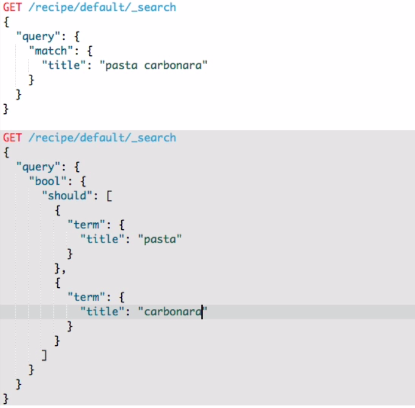
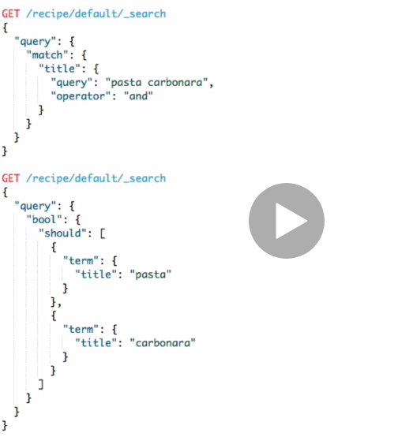

# join
```
PUT /department
{
	"mappings":{
		"_doc":{
			"properties":{
				"name":{
					"type":"text"
				},
				"employees":{
					"type":"nested"
				}
			}
		}
	}
}

POST /department/_doc/1
{
	"name":"Development",
	"employees":[
		{
			"name":"Eric Green",
			"age":39,
			"gender":"M",
			"position":"Big Data Specialist"
		},
		{
			"name":"James Taylor",
			"age":27,
			"gender":"M",
			"position":"Software Developer"
		}
	]
}

// this will not work because nested query cannot be queried like this
GET /department/_search
{
	"query":{
		"bool":{
			"must":[
				{
					"match":{
						"employees.position":"intern"
					}
				},
				{
					"term":{
						"employees.gender.keyword":{
							"value":"F"
						}
					}
				}
			]
		}
	}
}

// the right way
GET /department/_search
{
	"query":{
		"nested":{
			"path":"employees",
			"query":{
				"bool":{
					"must":[
			                           {
		                                        "match":{
                		                                "employees.position":"intern"
                                		        }
                                		},
                                {
                                        "term":{
                                                "employees.gender.keyword":{
                                                        "value":"F"
                                                }
                                        }
                                }

					]
				}
			}
		}
	}
}
```

# inner hits
what caused the document to match the query
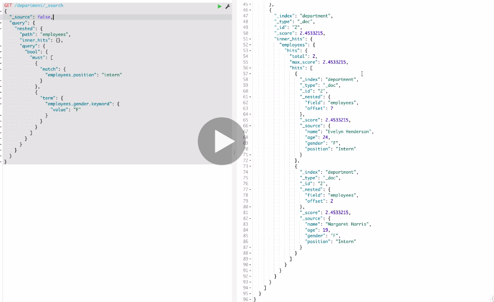


# Elasticsearch debug gems

* How to resolve unassigned shards in Elasticsearch   
[https://www.datadoghq.com/blog/elasticsearch-unassigned-shards/#reason-4-shard-data-no-longer-exists-in-the-cluster](https://www.datadoghq.com/blog/elasticsearch-unassigned-shards/#reason-4-shard-data-no-longer-exists-in-the-cluster)

* POST /_cluster/reroute API  
[https://www.elastic.co/guide/en/elasticsearch/reference/current/cluster-reroute.html](https://www.elastic.co/guide/en/elasticsearch/reference/current/cluster-reroute.html)
