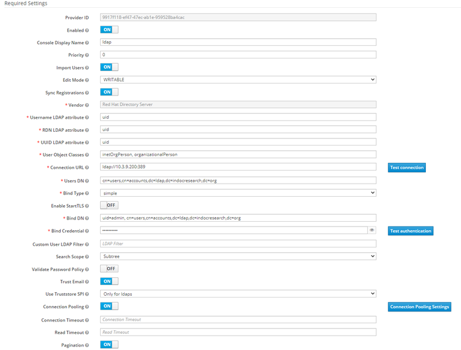
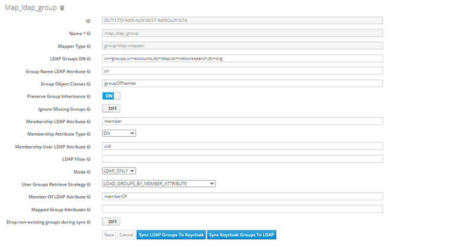
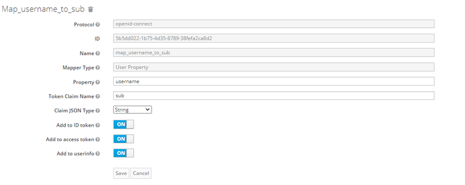

In this blog I will briefly describe   
* how to setup kong as API getway.   
* How to setup keycloak as IDP(identity provider).    
* How to setup LDAP server(freeipa as the user information storage).    
* How to setup OIDC connection between Kong and keycloak.    
# Install LDAP   
# Install keycloak
Installation:
Prerequisites: Docker   
Step 1: create database in postgresDB called keycloakdb  
Step2: run docker command to install keycloak   

```
sudo docker run -d -p 8080:8080 \
-e KEYCLOAK_USER=admin \
-e KEYCLOAK_PASSWORD=admin \
-e DB_USER=keycloak \
-e DB_PASSWORD=****** \
-e DB_ADDR=10.3.9.205:5432 \
-e DB_DATABASE=keycloakdb \
-e JDBC_PARAMS='verifyServerCertificate=false&useSSL=false' \
quay.io/keycloak/keycloak:10.0.2
```
### Configurations
After successfully installing and starting Keycloak, follow these steps to connect LDAP to Keycloak and configure token settings.
* Connect to LDAP   
Go to Keycloak Admin UI.    
Go to User Federation → add provider → ldap.    
Configure settings like the following and save:    
  
* Go to Mappers → Create.    
To map LDAP groups to Keycloak groups, configure a mapper like the following and save:   
    
* Create a client   
Go to Keycloak Admin UI.   
Go to Clients → Create.   
Configure the client settings like the following and save:   

 


Go to Mappers → Create.

To map username to token claim “sub“, configure a mapper like the following and save:
 

Change token settings
Go to Keycloak Admin UI.

Go to Realm Settings → Tokens.

To change token expiration time, modify the value of Access Token Lifespan.
