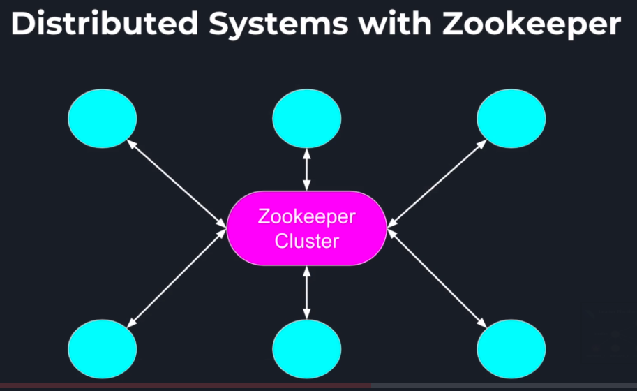

### Why we want a distributed system?
* Performance and storage
* Single point of failure
* high latency 
* Security and privacy

### What is distributed system
* A distributed system is a system of several processes, running on different computers, communicating with each other through the network, and are sharing a state or are working together to achieve a common goal

### What is a process? 
* When we compile a application into executable jar file or class, it is stored in our file system just like other text image music files. 
* When we launch an application, the operating sytem create a instance of that application in memory(process)   
* The process is entirely seperated from other processes on the computer   (no matter it is a instance of the same application or different application)
* The processes can communicate using the networks,  the file system, or memory  
**This is not a distributed system, because all the processes share the same computer**  

### What is node?
A process running on a dedicated machine as part of a distributed system (graph theory)  
### Cluster
* Collection of computers/nodes connected to each other
* The nodes in a cluster are working on the same task, and typically are running the same code  

### ZooKeeper
* Attemp 1 - manually elect a leader node(distributeing the work and collecting the result)
* Automatically elect the lead node - if the leader become unavailable, the system will automatically elect a new leader, and when the old leader recovers, the it will be no more a leader, it is a normal node
* ZooKeeper typically runs ina cluster of an odd number of nodes, higher than 3
* With zookeeper, instead of talking to each other, the nodes are talking to zookeeper server

* Zookeeper's abstraction and data model (each element in this tree(virtual file system) is a znode)
  * Znode is hybrid bwtween file and ditrectory(store like a file, have children like a directory)
  
* Persistent znode: stay between sessions(If one application disconnects from zookeeper and reconnects again, the persistent znode created by our application stays intact with all its children and data)
* Ephemeral znode is deleted as soon as the application that creates the znode disconnects from zookeeper

* Leader Election algorithm
  * Every node connects to zooleeper volunteers to become the leader
  * Each node submits its candidacy by adding a znode that represents itself under the election parent
  * Zookeeper maintains a global order, it can name each znode according to the order of addition
  * After each node creating its znode, it will query the current children of the election parent
  * Because the order zookeeper provides us, each node, when querying the election parent, is garanteed to see all the znodes created prior to its own znode
  

### Setup zookeeper
* download zookeeper
* extract zookeeper
* Create a logs folder in zookeeper home dir
* in conf rename ***sampel.cfg to zoo.cfg
* vim zoo.cfg change DataDir to logs folder
* ./zkpServer.sh start
* ./zkpServer.sh status
* ./zkpServer.sh stop
* When server started, run ./zkcli.sh (client)
```
help
ls /
create /parent "parent data"
create /parent/child "some child data"

```

### Zookeeper Threading Model
* Application's start code in the main method is executed on the main thread
* When zookeeper object is created, two additional threads are craeted by zookeeper library
  * Event Thread(handles all the zookeeper client state chage event, eg, connection and disconnection with the zookeeper server, also handles custom znode watchers and triggers we subscribe to, Events are executed on Event thread inorder)
  * IO thread (handles all the network communication with zookeeper servers, handles zookeeper requests and responses responds to pings session menagement, session timeouts)
  
### Watcher and trigger
* We  can register a watcher when we call the methods 
  * getChildren()
  * getData()
  * exists()
 
* The watcher allows us to get a notification when a change happends 
* If ```getChildren(.., watcher)``` It will return a list of children of a given znode, we'll get notified when the list of children changed
* exits(znodePath, watcher) - get notified if a znode gets deleted or created
* getData(znodePath, watcher) - Get notified if a znode's data gets modified
* public ZooKeeper(String connectString, int sessionTimeout, Watcher watcher) - also takes a watcher
* Watchers registered with getChildren(), exists() and getData() are one-time triggers
* If we want to get future notifications, we need to register the watcher again

### A herd Effect
* A large number of nodes waiting for an event. 
* When the event happends all nodes get notified and they all wake up
* only one node can succeed
* indicates bad design, can negatively impact the performance and can completetly freeze the cluster
 
[https://github.com/RyanGao67/DistributedJAVA20191217/blob/master/src/main/java/indoc/dev/com/leader/election/LeaderElection.java](https://github.com/RyanGao67/DistributedJAVA20191217/blob/master/src/main/java/indoc/dev/com/leader/election/LeaderElection.java)


### Multithreading vs distributed systems
* For multithreading, passing a message from one thread to another is easy, since all threads running on the same application, they all had a shared memory space. race condition(lock), semaphore for condition variable for signalling
* For distributed system, we do not have shared memory any more (can only use network)

**Application HTTP, FTP, SMTP**
**Transport TCP, UDP**
**Internet IP, ICMP**
***DataLink Ethernet, 802.11, ARP, RAPR*

### Datalink
* Physical delivery of data over a single link
* in charge of encapsulation of the data
* Flow control
* Error detection
* Error correction
* Ethernet protocol
* MAC address 1 <=> MAX address2 <=> MAC address3
* postal trucks plans schedule ...
### Internet layer
* takes service from datalink layer
* delivering data across multiple network
* routing the packegs from source computer to destination computer (IP)
* In this layer obtaining the IP address of computer we want to communicate
* IP address the address of recepient 
(Using internet layer only, we can delever the package to target computer, but we do not know which application process is the package intended for)
### Transport layer
* end to end   
* one process to another process   
* each end point (socket) identify itself as a 16 bits port(8081)  the listening port is chosen ahead of time by the destination application, The source port is generated on the fly by the sender depending on the ports available at the moment   
* User datagram protocol(udp)  
  * Connectionless
  * best effort - unreliable
  * messages can be lost duplicatied redordered
  * based on a unit called datagram which is limited in size
  * UDP is preferred when the speed and simplicity is more important than reliability
  * UDP use cases : sending  debug information to a distributed logging service
  * really time video/ online game
  * allow broadcasting decoupling between sender and receivers
* transmission control protocol(tcp)
  * reliable
  * connection between 2 points 
  * need to be created before data is sent
  * shut down in the end
  * unlike individual datagram, tcp works like a streaming interface(more popular in distributed)
  
  * Because TCP is based on exactly two points , even if we have two sources connected to the same IP and port , data flow will be split into two socket, and will be handle seperately by the application and os
  * Each tcp connection is identified by the full tuple source IP port and destination ip port
  * The only problem is that TCP works as plain stream of bytes(not distinguishing which bytes belong to what message)
  
### Application layer
* For the precious problem we need application layer
* Different protocal

  
  
